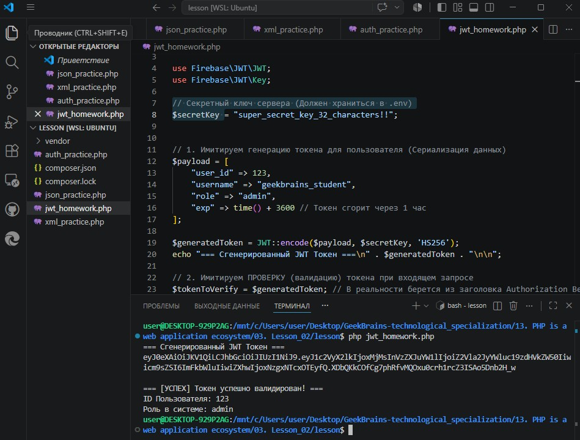
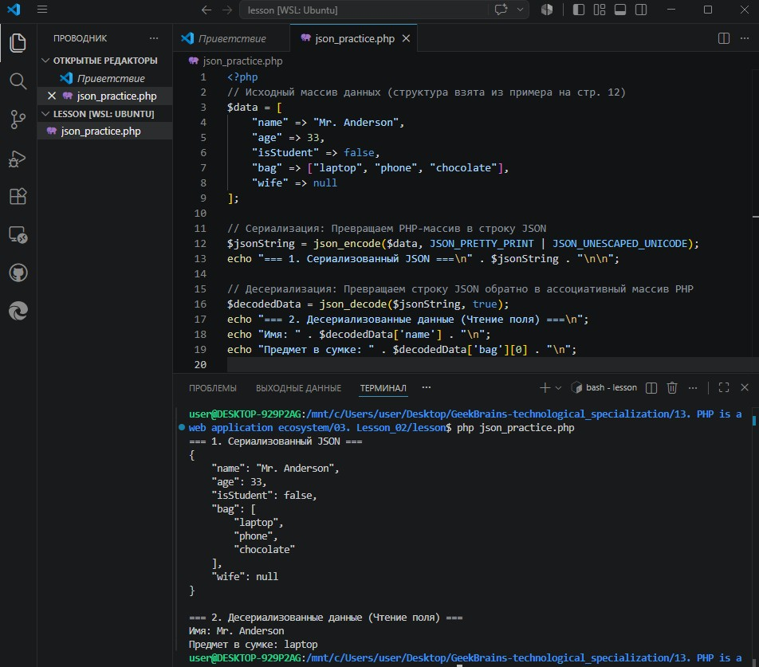
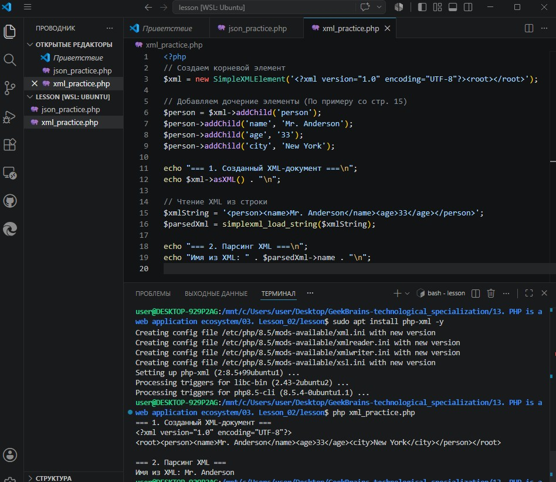
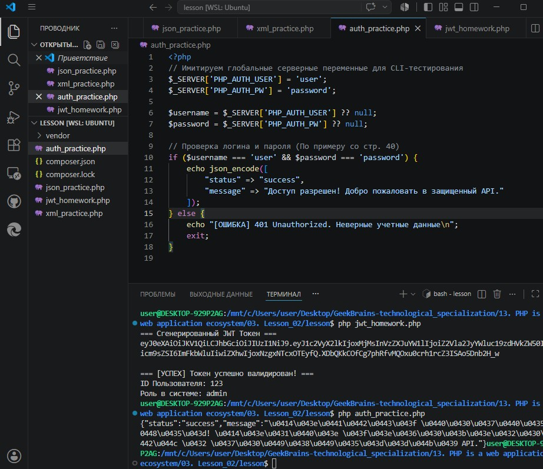

# Урок 3. Лекция: Backend API

## План урока

- писать свой API 
- работать с RPC, SOAP, WebSocket и REST
- работать с JSON, XML, Yaml и ProtoBuf
- аутентифицировать и авторизовывать API пользователей
- тестировать и документировать API


---

## Домашняя работа ([решение](https://github.com/olgashenkel/GeekBrains-technological_specialization/tree/main/13.%20PHP%20is%20a%20web%20application%20ecosystem/03.%20Lesson_02/lesson))

1. Взять любое API. Можно взять API на работе или любое общедоступное, например, catfact или yandex. Проанализируйте выбранное API по чек-листу:
    - по классификациям(состав участников, состояние, доступность)
    - по формату данных (JSON, XML, YAML, ProtoBuf)
    - по инструментам (REST, SOAP, RPC, websocket)
    - методу аутентификации и авторизации
    - по документации(насколько понятна, обновлена и.т.д)
2. (опционально) Выполните несколько запросов к выбранному API, используя любой сервис, описанный в блоке “Тестирование API”.


***Результат выполнения Домашней работы:***

**Задание № 1:**

1. **Архитектурный стиль vs Протокол:** `REST (Representational State Transfer)` — это гибкий архитектурный стиль (набор рекомендаций), в то время как `SOAP (Simple Object Access Protocol)` — это строгий, жестко стандартизированный протокол обмена данными.
2. **Формат данных:** `REST` преимущественно работает с легким и читаемым форматом `JSON` (хотя может использовать XML или YAML). `SOAP` работает исключительно с `XML`, что создает большие накладные расходы (оверхед) на парсинг и увеличивает объем трафика.
3. **Транспорт:** `REST` полностью опирается на протокол `HTTP` и активно использует его стандартные методы (GET, POST, PUT, DELETE) и коды ответов (200, 404, 500). `SOAP` независим от транспорта и может передавать сообщения через `HTTP`, `SMTP` или `TCP`, но при этом выполняет все действия через `POST-запросы` на один единственный `Endpoint`.
4. **Применение**: `REST` идеален для публичных веб-служб, мобильных приложений и микросервисов благодаря быстроте и простоте. `SOAP` применяется в крупных корпоративных системах (банковская сфера, госуслуги), где критически важна встроенная безопасность (WS-Security) и строгая типизация.


**Задание № 2: Реализация проверки токена JWT**

1. Установка зависимости
```
   bashsudo apt install composer -y
   composer require firebase/php-jwt
```

2. Создание скрипта проверки токена (jwt_homework.php):
```
php<?php
require 'vendor/autoload.php';

use Firebase\JWT\JWT;
use Firebase\JWT\Key;

// Секретный ключ сервера (Должен храниться в .env)
$secretKey = "super_secret_key_32_characters!!";

// 1. Имитируем генерацию токена для пользователя (Сериализация данных)
$payload = [
    "user_id" => 123,
    "username" => "geekbrains_student",
    "role" => "admin",
    "exp" => time() + 3600 // Токен сгорит через 1 час
];

$generatedToken = JWT::encode($payload, $secretKey, 'HS256');
echo "=== Сгенерированный JWT Токен ===\n" . $generatedToken . "\n\n";

// 2. Имитируем ПРОВЕРКУ (валидацию) токена при входящем запросе
$tokenToVerify = $generatedToken; // В реальности берется из заголовка Authorization Bearer

try {
    // Декодируем и проверяем подпись токена
    $decoded = JWT::decode($tokenToVerify, new Key($secretKey, 'HS256'));
    
    // Преобразуем объект в массив для удобства
    $userData = (array)$decoded;
    
    echo "=== [УСПЕХ] Токен успешно валидирован! ===\n";
    echo "ID Пользователя: " . $userData['user_id'] . "\n";
    echo "Роль в системе: " . $userData['role'] . "\n";

} catch (Exception $e) {
    echo "=== [ОШИБКА АУТЕНТИФИКАЦИИ] ===\n";
    echo "Причина: " . $e->getMessage() . "\n";
}
```

3. Тестирование
```
bashphp jwt_homework.php
```



---

## Практическая работа ([решение](https://github.com/olgashenkel/GeekBrains-technological_specialization/tree/main/13.%20PHP%20is%20a%20web%20application%20ecosystem/03.%20Lesson_02/lesson))

1. Работа с JSON в PHP (Сериализация и Десериализация)



2. Работа с XML через SimpleXML




3. Базовая аутентификация в API



