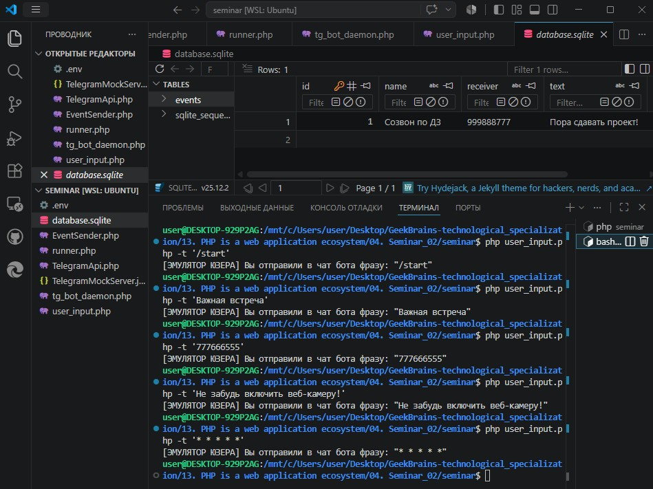
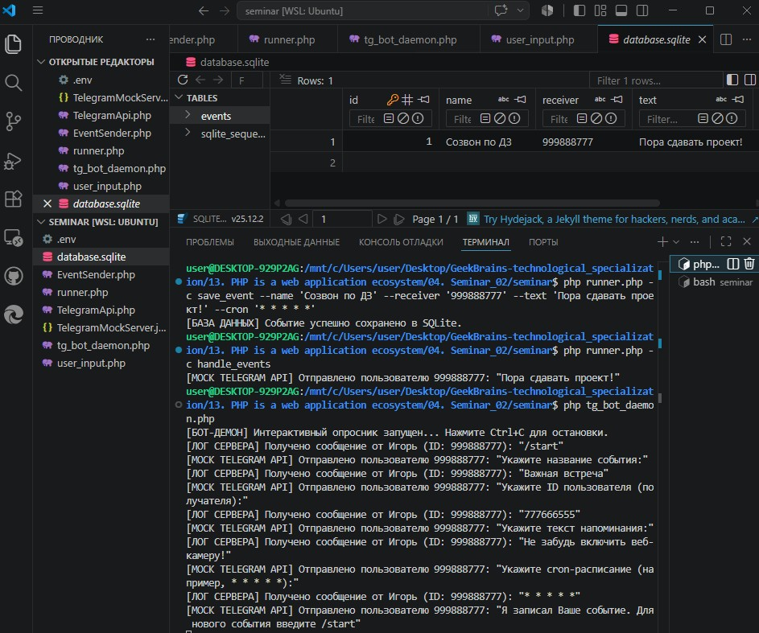

# Урок 2. Семинар: Консольный PHP

## План урока

- Выполнение практических заданий в соответствии с [презентацией](https://gbcdn.mrgcdn.ru/uploads/asset/6103330/attachment/a0ff3452f067fd43ae1d5f2470a8c2a6.pdf) к уроку
- Викторина, которая построена на основании реальных вопросов, которые задают на собеседовании
- Имитация работы выполнения заданий от тимлида
- Опыт получения ТЗ от тимлида
- Создание бота в Telegram
- Реализация отправки и получения запросов к Telegram

---

## Практическая работа и Домашняя работа на семинаре ([решение](https://github.com/olgashenkel/GeekBrains-technological_specialization/tree/main/12.%20PHP%20Basics/04.%20Seminar_02/seminar))

**Результат выполнения Практической и ДОмашней работы:**

1. Конфигурация проекта `.env` (Содержит вымышленные учетные данные (токен и ID))
2. Виртуальный сервер `TelegramMockServer.json`

3. Компонент интеграции `TelegramApi.php`

4.  Служба отправки `EventSender.php`

5. Диспетчер консольных команд `runner.php`

6. Интерактивный фоновый робот `tg_bot_daemon.php`

7. Консоль симуляции пользователя `user_input.php`

