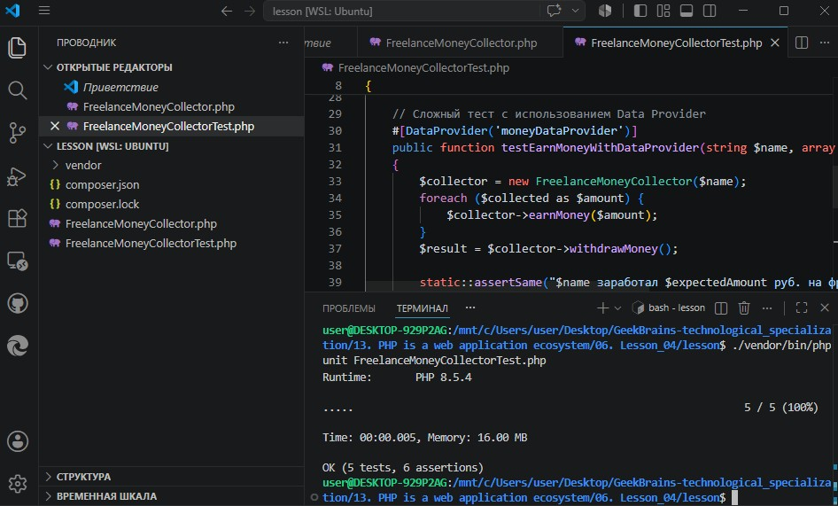
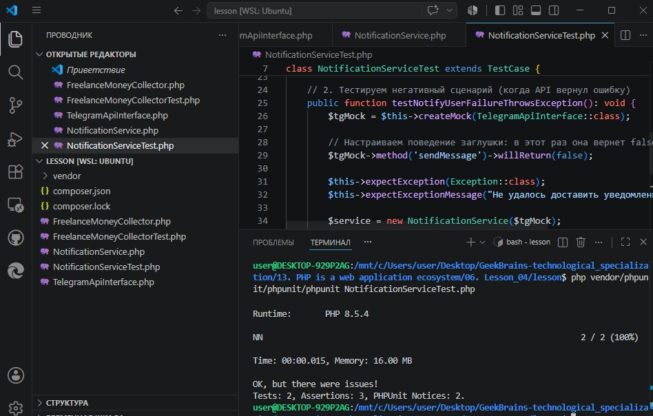

# Урок 6. Лекция: Тестирование приложений

## План урока

- разделять роли QA, QC и тестировщика
- понимать разницу между уровнями тестирования
- понимать разницу между различными видами тестирования
- писать unit-тесты 
- отвечать на базовые вопросы по тестированию на собеседовании


---

## Домашняя работа 

Вопрос № 1:   
Что хуже – плохие unit-тесты или их отсутствие?

Вопрос № 2:    
Определите тип тестирования:
- Заказчик просит загрузить готовое на 50% приложение на сервер, чтобы
запустить туда пользователей.
- Проверка интеграции страницы оплаты с сервисом ЮМани.
- Проверка регистрации пользователей.
- Система позволяет отменить заказ и вернуть покупателю деньги.


***Результат выполнения Домашней работы:***

Ответ на вопрос 1.   
**Плохие unit-тесты гораздо хуже их отсутствия**. Отсутствие тестов — это честная слепая зона: разработчики знают о рисках и проверяют код вручную. Плохие же тесты создают **ложное чувство безопасности** (когда тесты «зеленые», но код в продакшене падает) либо превращаются в обузу (когда при малейшем рефакторинге приходится переписывать сотни хрупких тестов, завязанных на внутреннюю реализацию, а не на контракт).


Ответ на вопрос 2.   
1. Бета-тестирование. Ранняя стабильная версия продукта отдается реальным пользователям для сбора отзывов вне тестовой среды.
2. Функциональное (интеграционное) тестирование. Проверяется правильность вызовов API, передача данных и корректность взаимодействия бэкенда приложения со сторонним сервисом.
3. Тестирование критического пути (функциональный вид, системный уровень). Регистрация — это ключевой функционал, который большинство пользователей используют в повседневной жизни.
4. Расширенное тестирование (функциональный вид). Проверяется бизнес-логика и заявленные требования к обработке нетипичных или второстепенных пользовательских сценариев.

---

## Практическая работа ([решение](https://github.com/olgashenkel/GeekBrains-technological_specialization/tree/main/13.%20PHP%20is%20a%20web%20application%20ecosystem/06.%20Lesson_04/lesson))


### Выполнение практической части (Unit-тестирование)

1. Инициализация PHPUnit через Composer
```
composer require --dev phpunit/phpunit
```
2. Создание тестируемого класса `FreelanceMoneyCollector.php`
3. Написание `Unit-тестов` с `Data Provider` (файл `FreelanceMoneyCollectorTest.php`)
4. Запуск тестов
```
./vendor/bin/phpunit FreelanceMoneyCollectorTest.php
```



### Использование Тестовых Двойников (Mocks/Stubs)

1. Создаем зависимость (Интерфейс API) - `TelegramApiInterface.php `

2. Создаем тестируемый класс службы `NotificationService.php`

3. Написание Unit-теста с использованием Mock-объекта - `NotificationServiceTest.php`

4. Запуск тестов
```
php vendor/phpunit/phpunit/phpunit NotificationServiceTest.php
```


