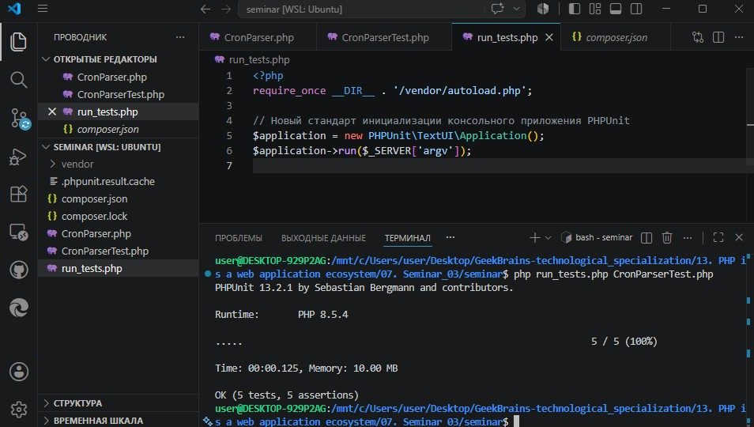

# Урок 7. Семинар: Тестирование приложений

## План урока

- Выполнение практических заданий в соответствии с [презентацией](https://gbcdn.mrgcdn.ru/uploads/asset/6103331/attachment/3608fdc1ae84b8649725c95932ceff75.pdf) к уроку
- Викторина, которая построена на основании реальных вопросов, которые задают на собеседовании
- Имитация работы выполнения заданий от тимлида
- Создание unit-теста на код, который мы написали ранее

---

## Практическая работа и Домашняя работа семинара ([решение](https://github.com/olgashenkel/GeekBrains-technological_specialization/tree/main/13.%20PHP%20is%20a%20web%20application%20ecosystem/07.%20Seminar_03/seminar))


**Результат выполнения Практической и Домашней работы:**

1. Разворачиваем окружение PHPUnit

```
/* Создаем конфигурацию: */
bashcomposer init --no-interaction

/* Устанавливаем PHPUnit: */
composer require --dev phpunit/phpunit --prefer-source
```

2. Создание файлов проекта - `CronParser.php`, `CronParserTest.php`, `run_tests.php`


3. Финальный запуск

```
php run_tests.php CronParserTest.php
```




### Задание 4\*. Имитация поломки тестов для получения разных типов результатов.
При запуске `PHPUnit` мы сталкиваемся с тремя основными результатами работы тестов:
1. **OK (Успех):** Все утверждения (assert) верны.
2. **F (Failure / Провал):** Код работает без фатальных ошибок, но бизнес-логика нарушена.
   - *Как получить:* Измените в cronTimeProvider ожидаемое значение для звездочки с true на false и запустите тест. Вы получите FAILURES!.
3. **E (Error / Ошибка):** Сам код содержит синтаксическую ошибку, обращается к несуществующему классу или выбрасывает необработанное исключение.
    - *Как получить:* Допишите в коде теста вызов несуществующей функции (например, $parser->undefinedMethod();). Тест упадет со статусом Errors!


### Задание 5\*. Как избавиться от побочных эффектов в коде (БД, Telegram API) для написания Unit-тестов? 

Чтобы сделать Unit-тестирование приложения Reminders возможным, необходимо применить принцип инверсии зависимостей (Dependency Inversion из SOLID) и рефакторинг кода:
1. **Выделение интерфейсов (Abstraction):** Прямые вызовы PDO и сURL-запросов к Telegram API должны быть обернуты в абстрактные интерфейсы, например, EventRepositoryInterface и NotificationServiceInterface.
2. **Внедрение зависимостей (Dependency Injection):** Класс-обработчик (например, Runner или Worker) не должен сам создавать объекты подключения внутри себя через new PDO(). Он должен принимать их извне через аргументы конструктора.
3. **Использование Тестовых Двойников (Mocks/Stubs):** В среде PHPUnit мы сможем легко подменить реальную базу данных и серверы Telegram на легкие «Mocks»-заглушки, которые будут симулировать успешную запись строк или отправку HTTP-ответов без реального выхода в сеть и выполнения дисковых операций.