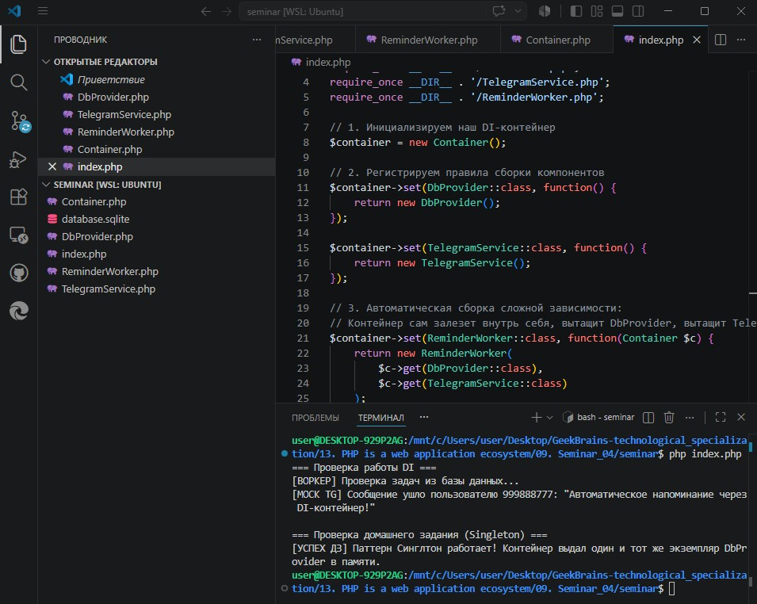

# Урок 9. Семинар: Продвинутое unit-тестирование

## План урока

- Выполнение практических заданий в соответствии с [презентацией](https://gbcdn.mrgcdn.ru/uploads/asset/6103332/attachment/8d73d62526e70a7353683dd73381d280.pdf) к уроку
- Викторина, которая построена на основании реальных вопросов, которые задают на собеседовании
- Имитация работы выполнения заданий от тимлида
- Улучшение unit-тестов, которые написали на прошлом уроке


---

## Практическая работа и Домашняя работа семинара ([решение](https://github.com/olgashenkel/GeekBrains-technological_specialization/tree/main/13.%20PHP%20is%20a%20web%20application%20ecosystem/09.%20Seminar_04/seminar))


**Результат выполнения Практической и Домашней работы:**

### ЧАСТЬ 1. Реализация практической части Семинара
1. Создаем класс для работы с БД (`DbProvider.php`)
2. Создаем службу уведомлений (`TelegramService.php`)
3. Создаем главный воркер (`ReminderWorker.php`)


### ЧАСТЬ 2. Реализация DI-Контейнера + Домашнее Задание

В Домашнем задании из презентации требуется доработать контейнер так, чтобы он поддерживал паттерн Синглтон (Singleton). Это значит, что если мы один раз создали объект DbProvider (подключение к базе), при повторном запросе контейнер должен выдать тот же самый уже созданный объект, а не открывать новое соединение.

1. Создаем продвинутый контейнер (`Container.php`)


### Часть 3. Точка входа и проверка работы системы

1. Создаем управляющий файл `index.php`
2. Запуск в терминале
```
php index.php
```

