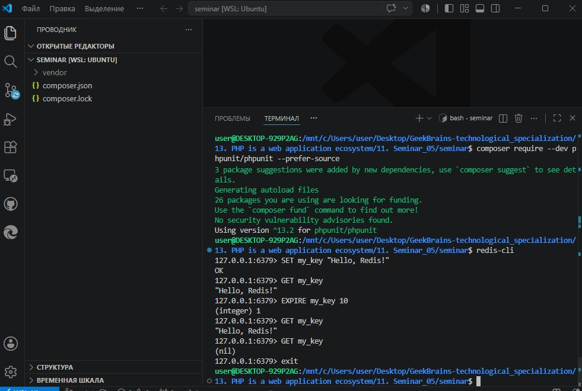
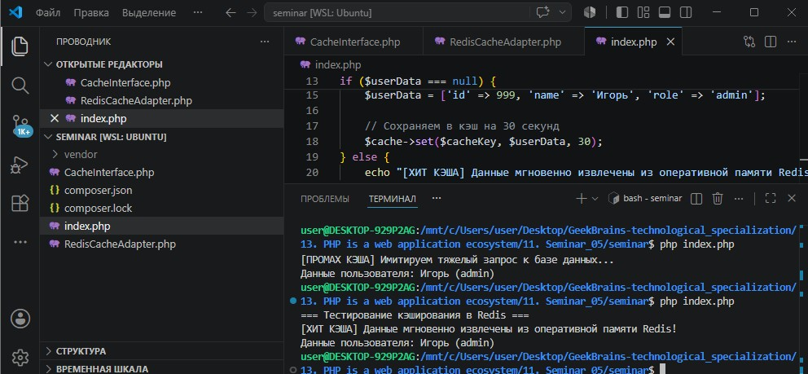
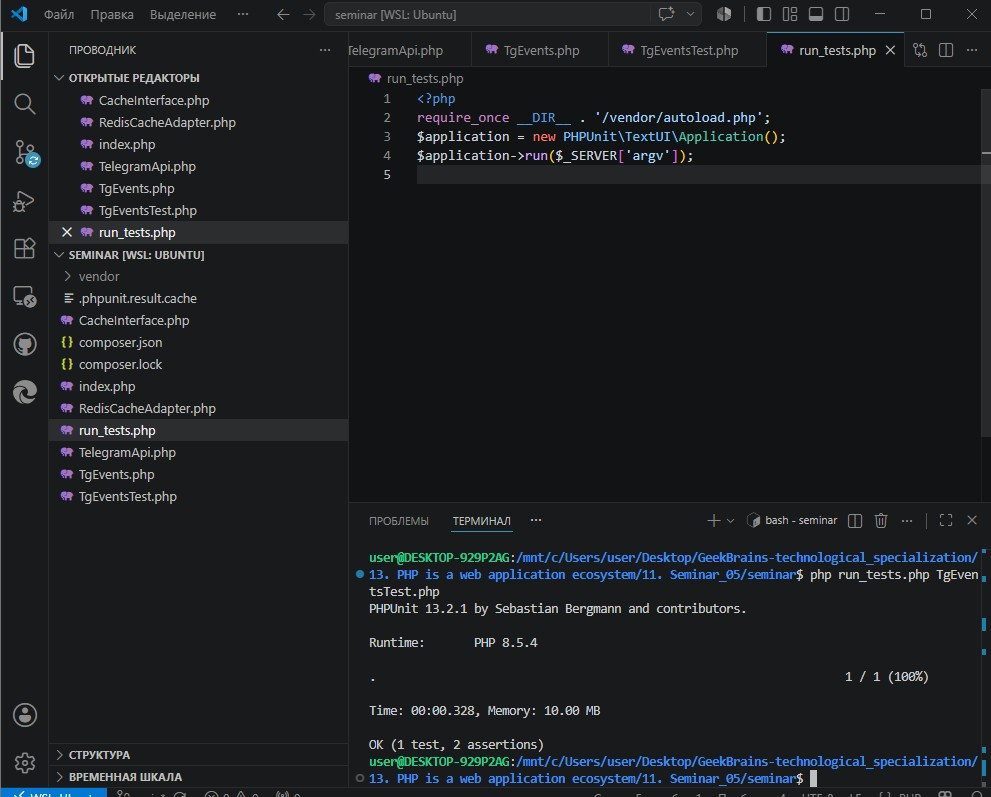

# Урок 11. Семинар: Кэширование в PHP

## План урока

- Выполнение практических заданий в соответствии с [презентацией](https://gbcdn.mrgcdn.ru/uploads/asset/6103333/attachment/b525f0c685f4055b0b10aafbb8ca2983.pdf) к уроку
- Имитация работы выполнения заданий от тимлида
- Опыт постановки ТЗ от тимлида
- Опыт работы с операциями redis
- Опыт кеширования участков кода

---

## Практическая работа и Домашняя работа семинара ([решение](https://github.com/olgashenkel/GeekBrains-technological_specialization/tree/main/13.%20PHP%20is%20a%20web%20application%20ecosystem/11.%20Seminar_05/seminar))


**Результат выполнения Практической и Домашней работы:**


### Часть 1. Разворачиваем окружение (Redis + Predis + PHPUnit)

Поскольку работа происходит в изолированной среде WSL (Ubuntu), необходимо установить сам сервер Redis и скачать необходимые библиотеки через Composer.

```
# 1. Обновляем пакеты и устанавливаем сервер Redis в Ubuntu
sudo apt-get update
sudo apt-get install redis-server -y

# 2. Запускаем службу Redis (если она не запустилась сама)
sudo service redis-server start

# 3. Инициализируем Composer в новой папке
composer init --no-interaction

# 4. Скачиваем библиотеку predis для работы с Redis из PHP
composer require predis/predis --prefer-source

# 5. Устанавливаем PHPUnit для тестирования
composer require --dev phpunit/phpunit --prefer-source
```


### Часть 2. Выполнение практических заданий семинара

1. Работа с Redis из консоли
```
redis-cli
```

Консоль Redis. Базовые операции:
- **SET и GET (Строки):** `SET my_key "Hello, Redis!"` -> GET my_key 
- **TTL (Время жизни):** `EXPIRE my_key 10` -> Спустя 10 секунд ключ удалится.
- **Выход из консоли:** `exit`.




2. Создание адаптера для работы с Redis (По ТЗ Тимлида) 
    - файл `CacheInterface.php`
    - файл `RedisCacheAdapter.php`
    - проверочный файл `index.php`:

3. Тестирование:




### Часть 3. Написание тестов и выполнение ДЗ

1. Тестовый сценарий для системы уведомлений на чистом PHPUnit.
    - файл `TelegramApi.php` (Зависимость)
    - файл `TgEvents.php` (Тестируемый компонент)
    - файл `TgEventsTest.php` (Реализация архитектуры тестов)
    - файл запуска тестов `run_tests.php`
2. Запуск тестов: `php run_tests.php TgEventsTest.php`




### Часть 4. Краткие ответы на вопросы викторины

Какой основной минус кэширования?
- Риск использования приложением устаревших (невалидных/неактуальных) данных в случае, если источник данных обновился, а кэш еще не инвалидировался

В чём принципиальное отличие денормализации от материализации?
- Материализация — это создание статических таблиц-срезков на уровне БД, обновляемых СУБД по расписанию. 
- Денормализация — это намеренное изменение структуры таблиц (дублирование колонок) на этапе проектирования схем для ускорения SELECT-запросов.

Что «дешевле»: материализация или кэширование?
- Кэширование в оперативной памяти (Redis/Memcached) значительно «дешевле» по времени ответа, так как полностью исключает дисковые операции ввода-вывода (I/O) СУБД.