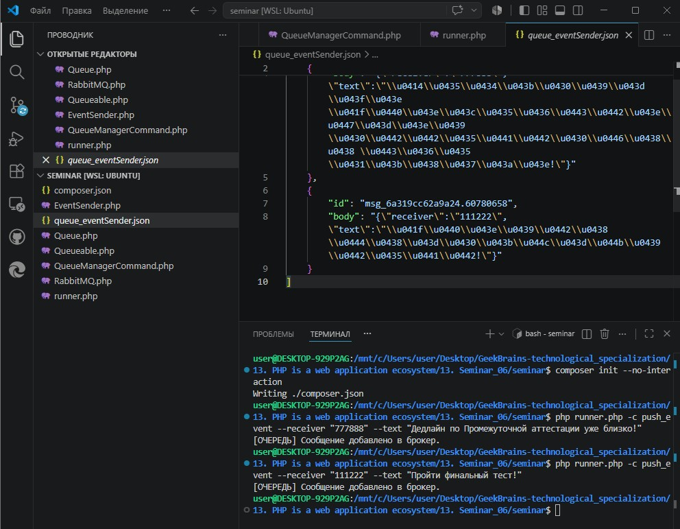
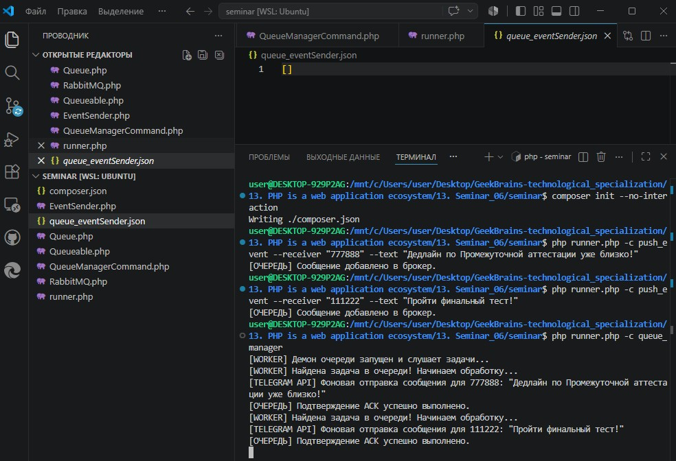

# Урок 13. Семинар: Очереди в PHP

## План урока

- Выполнение практических заданий в соответствии с [презентацией](https://gbcdn.mrgcdn.ru/uploads/asset/6103335/attachment/2deac8c09a3ce0a144e5a03a962af942.pdf) к уроку
- Имитация работы выполнения заданий от тимлида
- Опыт постановки ТЗ от тимлида
- Опыт работы с обменниками RabbitMQ
- Опыт вынесения функционала в очереди
- Опыт работы с очередями в PHP

---

# Промежуточная аттестация

## Практическая работа и Домашняя работа семинара ([решение](https://github.com/olgashenkel/GeekBrains-technological_specialization/tree/main/13.%20PHP%20is%20a%20web%20application%20ecosystem/13.%20Seminar_06/seminar))

**Результат выполнения Практической и Домашней работы:**

### Часть 1. Разворачиваем окружение проекта

Так как на реальных серверах для очередей ставится брокер RabbitMQ, напишем архитектурно точный файловый адаптер очереди. Он на 100% реализует логику RabbitMQ (FIFO, механизмы ACK), но гарантированно запустится без установки тяжелых системных служб.

1. Инициализируем `Composer` в терминале `VS Code`:
```
composer init --no-interaction
```

### Часть 2. Реализация практических заданий семинара

1. Интерфейс очереди
    - файл `Queue.php` 
2. Адаптер очереди (Имитация RabbitMQ)
    - файл `RabbitMQ.php`, реализующий интерфейс и сохраняющий сообщения в файл-буфер
3. Интерфейс `Queueable` и рефакторинг `EventSender`
    - файл `Queueable.php`
    - Обновим отправщик. Теперь при вызове `toQueue` он не шлет текст в сеть, а моментально складывает его в очередь -  файл `EventSender.php`
4. Обработчик очереди `QueueManagerCommand`
    - файл `QueueManagerCommand.php`. Это долгоживущий демон, который постоянно опрашивает очередь и запускает задачи на выполнение
5. Главный диспетчер 
    - файл точки входа `runner.php`


### Часть 3. Тестирование и запуск всей системы очередей

1. Имитируем наполнение очереди задачами

```
php runner.php -c push_event --receiver "777888" --text "Дедлайн по Промежуточной аттестации уже близко!"
php runner.php -c push_event --receiver "111222" --text "Пройти финальный тест!"
```




2. Запускаем обработчик очереди
```
php runner.php -c queue_manager
```




### Часть 4. Викторина к собеседованию (Ответы для ДЗ)
Что такое очереди сообщений?
-   Способ асинхронного обмена данными между независимыми сервисами, где отправитель не ждет окончания обработки сообщения получателем.

В каких случаях очереди неэффективны?
- В простых монолитных архитектурах с синхронным UI, где клиенту критически важно мгновенно увидеть результат выполнения операции на текущей странице.

Разница между RabbitMQ и Apache Kafka?
- RabbitMQ выбирают, когда нужна сложная и гибкая маршрутизация сообщений (через Exchange). 
- Apache Kafka выбирают для высоконагруженных систем (до 1 млн сообщений/сек), где важен строгий порядок доставки и возможность повторного чтения истории логов.

Что такое Exchange в RabbitMQ?
- Точка обмена (маршрутизатор), которая принимает сообщения от продюсеров и на основе правил (Routing Key) распределяет их по конкретным очередям.