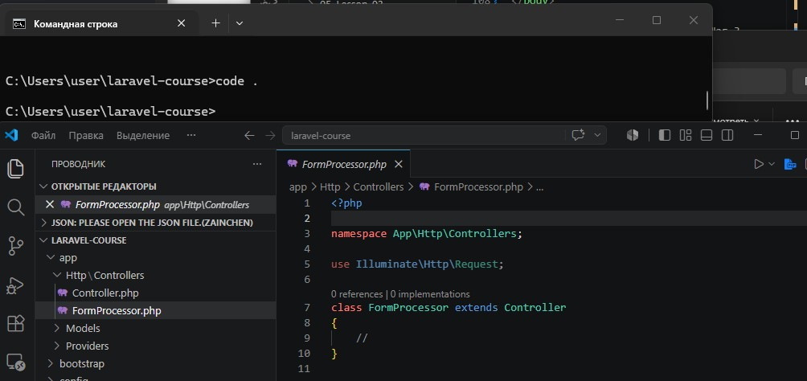
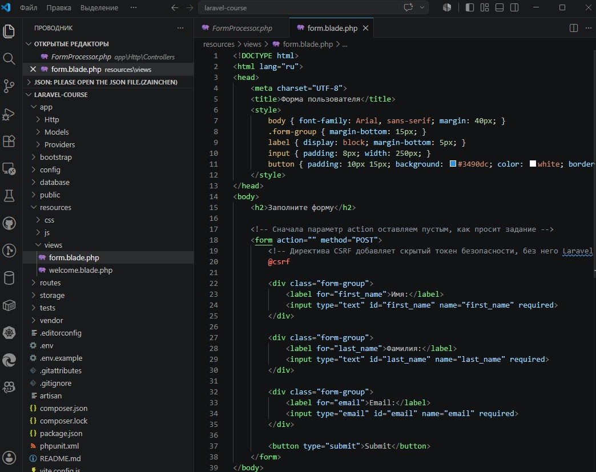
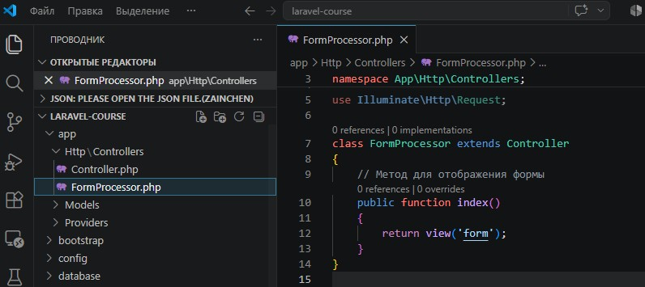
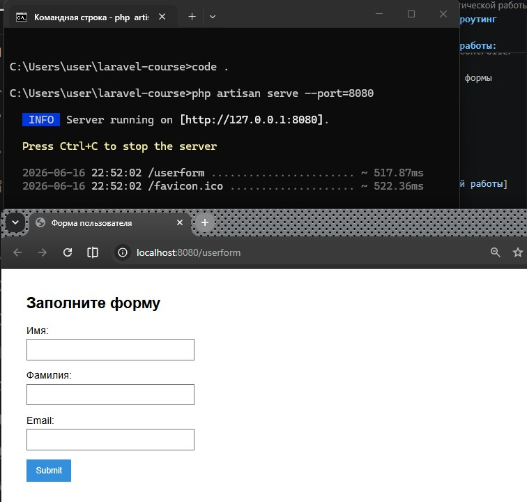
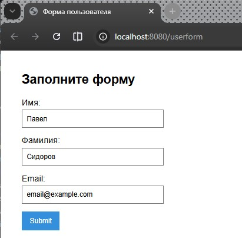
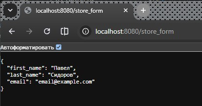
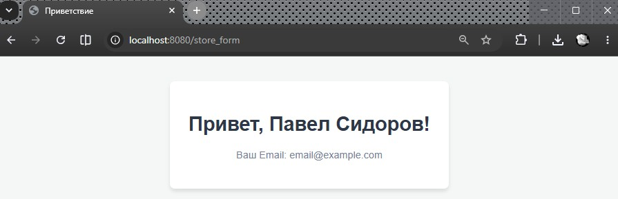

# Урок 2. Контроллеры, экшены и роутинг

## Цели практической работы:

Вы научитесь:
- устанавливать Laravel;
- создавать контроллер, возвращающий JSON;
- создавать контроллер для обработки формы;
- создавать контроллер, возвращающий шаблон.


Вам предстоит установить фреймворк `Laravel` и создать контроллер, содержащий экшены для вывода и обработки формы.

1. Установите `Laravel` с помощью `composer`, выполнив команду `composer create-project laravel/laravel <имя проекта>`. В поле `<имя проекта>` впишите имя вашего проекта. Этому имени будет соответствовать имя папки, в которую вы поместите проект.

2. Создайте контроллер для вывода формы на страницу и её обработки. В командную строку введите команду `php artisan make:controller FormProcessor`.

3. После выполнения команды убедитесь, что контроллер создан, — соответствующий файл должен появиться в папке `app/Http/Controllers`.

4. Внутри контроллера опишите метод `index`: он должен выводить в браузер форму для заполнения.
- Опишите форму в виде шаблона `blade`.
- Внутри формы должны быть поля для ввода `имени`, `фамилии` и `email` пользователя.
- Форма отправляется методом `POST`.
- Параметр `action` пока оставьте пустым.
- Не забудьте про `CSRF`.

5. Внутри файла `/routes/web.php` опишите новый роут (метод `GET`), который будет вызывать метод `index` контроллера `FormProcessor` по `url /userform`.

6. Запустите встроенный сервер `Laravel` командой `php artisan serve --port=8080` и убедитесь, что форма выводится по адресу http://localhost:8080/userform.

7. В контроллере `FormProcessor` создайте метод `store` для обработки формы. Этот метод должен принимать поля формы и отправлять ответ в виде `JSON-объекта`, содержащего значения полей формы (`имя`, `фамилия`, `email`).

8. Внутри файла `/routes/web.php` опишите новый роут (метод `POST`), который будет вызывать метод `store` контроллера `FormProcessor` по `url /store_form`.

9. Отредактируйте поле `action` формы в шаблоне и укажите адрес `/store_form`.

10. Откройте форму в браузере по адресу http://localhost:8080/userform, заполните её и попробуйте отправить на сервер, нажав кнопку `Submit`. Если всё сделано правильно, вы увидите в браузере объект `JSON`.

11. Создайте новый шаблон `blade` для приветствия пользователя (например: `«Привет, <имя>!»`).

12. Измените метод `store` контроллера `FormProcessor` таким образом, чтобы вместо `JSON` он возвращал шаблон, заполненный данными пользователя.

13. Сделайте коммит своих изменений с помощью `git` и отправьте `push` в репозиторий.

### Советы и рекомендации
Старайтесь писать в `commit message` то, что отражает смысл вашего кода.


### Критерии оценки работы:

**Принято:** 
- выполнены все пункты задания;
- в работе используются указанные инструменты и соблюдены условия;
- код корректно отформатирован по стандартам программирования на PHP;
- скрипт запускается, выводит различные данные на экран, не вызывает ошибок.

**На доработку:**
- выполнены не все обязательные пункты задания;
- задание выполнено с ошибками.

### Как отправить работу на проверку
Отправьте коммит, содержащий код задания, на ветку `master` в вашем репозитории и пришлите его `URL (URL Merge Request’а)` через форму. Репозиторий должен быть `public`.

--- 

### Ход выполнения Практической работы:

1. Создание контроллера 
    ```
    php artisan make:controller FormProcessor
    ```

    


2. Создание шаблона формы
    - в папке `resources/views/` создан файл `form.blade.php`
    
        ```
        <!DOCTYPE html>
        <html lang="ru">
        <head>
            <meta charset="UTF-8">
            <title>Форма пользователя</title>
            <style>
                body { font-family: Arial, sans-serif; margin: 40px; }
                .form-group { margin-bottom: 15px; }
                label { display: block; margin-bottom: 5px; }
                input { padding: 8px; width: 250px; }
                button { padding: 10px 15px; background: #3490dc; color: white; border: none; cursor: pointer; }
            </style>
        </head>
        <body>
            <h2>Заполните форму</h2>
            
            <!-- Сначала параметр action оставляем пустым, как просит задание -->
            <form action="" method="POST">
                <!-- Директива CSRF добавляет скрытый токен безопасности, без него Laravel выдаст ошибку 419 -->
                @csrf 
                
                <div class="form-group">
                    <label for="first_name">Имя:</label>
                    <input type="text" id="first_name" name="first_name" required>
                </div>

                <div class="form-group">
                    <label for="last_name">Фамилия:</label>
                    <input type="text" id="last_name" name="last_name" required>
                </div>

                <div class="form-group">
                    <label for="email">Email:</label>
                    <input type="email" id="email" name="email" required>
                </div>

                <button type="submit">Submit</button>
            </form>
        </body>
        </html>
        ```    
    
    


3. Написание метода `index` и настройка роута

    ```
    /* app/Http/Controllers/FormProcessor.php */

    <?php

    namespace App\Http\Controllers;

    use Illuminate\Http\Request;

    class FormProcessor extends Controller
    {
        // Метод для отображения формы
        public function index()
        {
            return view('form');
        }
    }
    ```

    


    ```
    /* routes/web.php */

    use App\Http\Controllers\FormProcessor;

    Route::get('/userform', [FormProcessor::class, 'index']);
    ```


4. Проверка вывода формы


    


5. Обработка формы и вывод JSON

    ```
    /* app/Http/Controllers/FormProcessor.php */

    // Метод для обработки данных формы
    public function store(Request $request)
    {
        // Собираем данные из полей формы
        $userData = [
            'first_name' => $request->input('first_name'),
            'last_name'  => $request->input('last_name'),
            'email'      => $request->input('email'),
        ];

        // Пункт 7: Сначала возвращаем данные в виде JSON-объекта
        return response()->json($userData);
    }
    ```

    ```
    /* routes/web.php */

    Route::post('/store_form', [FormProcessor::class, 'store']);
    ```

    ```
    /* resources/views/form.blade.php */

    <form action="/store_form" method="POST">
    ```

6. Проверка JSON в браузере

    

    

7. Шаблон приветствия и изменение метода store

    В папке `resources/views/` создание нового файла с именем `welcome_user.blade.php`

    ```
    <!DOCTYPE html>
    <html lang="ru">
    <head>
        <meta charset="UTF-8">
        <title>Приветствие</title>
        <style>
            body { font-family: Arial, sans-serif; margin: 40px; background: #f4f7f6; text-align: center; }
            .card { background: white; padding: 30px; border-radius: 8px; display: inline-block; box-shadow: 0 4px 6px rgba(0,0,0,0.1); }
            h1 { color: #2d3748; }
            p { color: #718096; }
        </style>
    </head>
    <body>
        <div class="card">
            <!-- Выводим переданные переменные -->
            <h1>Привет, {{ $firstName }} {{ $lastName }}!</h1>
            <p>Ваш Email: {{ $email }}</p>
        </div>
    </body>
    </html>
    ```

    Изменение возвращаемого значения в методе `store`, чтобы вместо `JSON` возвращался новый шаблон с данными:

    ```
    public function store(Request $request)
    {
        // Получаем данные из запроса
        $firstName = $request->input('first_name');
        $lastName  = $request->input('last_name');
        $email     = $request->input('email');

        // Пункт 12: Возвращаем шаблон, передавая в него переменные
        return view('welcome_user', compact('firstName', 'lastName', 'email'));
    }
    ```

8. Финальная проверка в браузере

    
