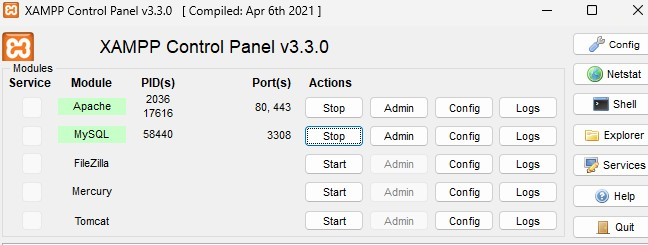
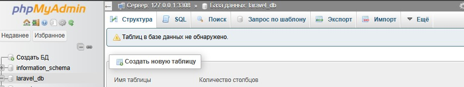
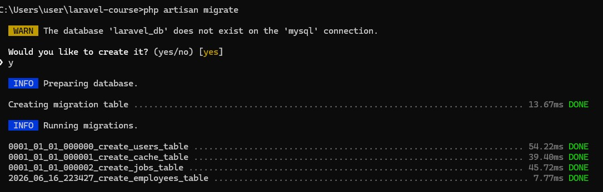
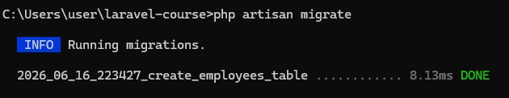
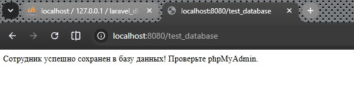
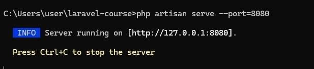
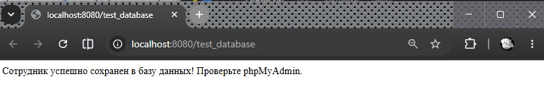
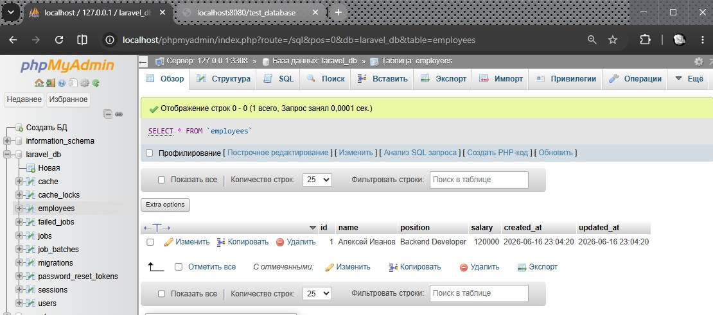

# Урок 3. Работа с базами данных. ORM-система Eloquent

## Цели практической работы:

Научиться:

— создавать новые базы данных;
— создавать новые таблицы внутри базы данных;
— подключаться к базе данных через Laravel;
— заполнять таблицы необходимыми данными при помощи Eloquent ORM.


Что нужно сделать:

Создайте базу данных, в ней — новую таблицу. Заполните поля, после чего сделайте выборку данных по указанным полям:

1. Для создания, просмотра и редактирования баз данных MySQL установите программу PhpMyAdmin по [инструкции](http://). Если у вас на компьютере установлен WAMP или XAMPP, то PhpMyAdmin тоже должен быть установлен.

2. Создайте базу данных с любым именем в PhpMyAdmin. Больше в нём ничего делать не нужно, остальное выполните в коде проекта.

3. В папке проекта настройте файл конфигурации для базы данных. Пример:
    ```
    'mysql' => [
    'read' => [
    'host' => '192.168.1.1',
    ],
    'write' => [
    'host' => '196.168.1.2'
    ],
    'driver' => 'mysql',
    'database' => 'database',
    'username' => 'root',
    'password' => '',
    'charset' => 'utf8',
    'collation' => 'utf8_unicode_ci',
    'prefix' => '',
    ],
    ```
4. Создайте проект Laravel с помощью composer, выполнив команду `composer create-project laravel/laravel <имя проекта>`.

5. В корне проекта создайте файл .env и укажите параметры подключения к базе данных. После редактирования файла .env выполните команду `php artisan config:clear`.

6. В папке проекта через командную строку создайте новую модель Employee. Одновременно с этим создайте файл миграции. Для этого в команде создания модели можно использовать флаг -m:` php artisan make:model Employee -mfsc`. Флаг -mfsc создаст модель, наполнитель, контроллер и файл миграции.

7. С помощью команды `php artisan migrate` выполните миграции.

8. В файле `routes/web.php` создайте новый эндпоинт, например `test_database`:
    ```
    Route::get('/test_database', function () {
    //Код внутри колбэка
    });
    ```

9. Внутри функции-колбэка напишите код, который создаст новый экземпляр модели `Employee`, и сохраните его в базу данных с помощью метода `save()`.

10. Запустите локальный сервер Laravel с помощью команды `php artisan serve`.

11. Перейдите по ссылке `<адрес вашего локального сервера>/test_database` (по умолчанию http://localhost:8000/test_database).

12. Используйте `phpMyAdmin`, чтобы убедиться, что в вашей базе данных создались таблицы `employees` и `migrations`, а в таблице `employees` создалась новая строка, соответствующая экземпляру модели `Employee`.

13. Сделайте коммит своих изменений с помощью `Git` и отправьте `push` в репозиторий.


### Критерии оценки:

**Принято: **
- выполнены все пункты работы;
- в работе используются указанные инструменты и соблюдены условия;
- код корректно отформатирован по стандартам программирования на PHP;
- скрипт запускается, выводит различные данные на экран, не вызывает ошибок.

**На доработку:** работа выполнена не полностью или с ошибками.

### Как отправить работу на проверку:

Отправьте коммит, содержащий код задания, на ветку master в вашем репозитории и пришлите его URL (URL Merge Request’а) через форму. Репозиторий должен быть public.


--- 

### Ход выполнения Практической работы:

1. Запуск MySQL в XAMPP

    


2. Создание Базы Данных в phpMyAdmin

    


    
3. Настройка файла `.env` в Laravel
    - блок `DB_ `:
        ```
        iniDB_CONNECTION=mysql
        DB_HOST=127.0.0.1
        DB_PORT=3308
        DB_DATABASE=laravel_db
        DB_USERNAME=root
        DB_PASSWORD=
        ```
    - команда сброса кеша настроек, чтобы Laravel точно читал эти данные:
        ```
        cmdphp artisan config:clear
        ```

4. Создание Модели, Миграции и Контроллера
    - генерируем необходимые файлы для сущности `«Сотрудник» (Employee)`. Команда в консоли:
    ```
    php artisan make:model Employee -mfsc
    ```

5. Настройка полей в файле миграции

    - `database/migrations/`
    - файл `xxxx_xx_xx_xxxxxx_create_employees_table.php`
    - функция `public function up()` 
    ```
        public function up(): void
    {
        Schema::create('employees', function (Blueprint $table) {
            $table->id();
            $table->string('name');       // Имя сотрудника
            $table->string('position');   // Должность
            $table->integer('salary');    // Зарплата
            $table->timestamps();
        });
    }
    ```

6. Запуск миграции (Создание таблиц)
    - консоль 
        ```
        php artisan migrate
        ```
        
        

                
        


7. Настройка эндпоинта (Маршрута)
    -  логика, которая при переходе на страницу будет создавать сотрудника и сохранять его в базу
    -  файл `routes/web.php`
    ```
    use App\Models\Employee;
    ...

    Route::get('/test_database', function () {
        // Создаем объект сотрудника
        $employee = new Employee();

        // Заполняем его данными
        $employee->name = 'Алексей Иванов';
        $employee->position = 'Backend Developer';
        $employee->salary = 120000;

        // Сохраняем в созданную таблицу MySQL
        $employee->save();

        return 'Сотрудник успешно сохранен в базу данных! Проверьте phpMyAdmin.';
    });
    ```

8. Финальный запуск сервера и проверка
    ```
    php artisan serve --port=8080
    ```

    


    


    


    


    
