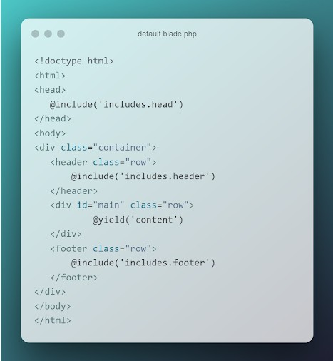
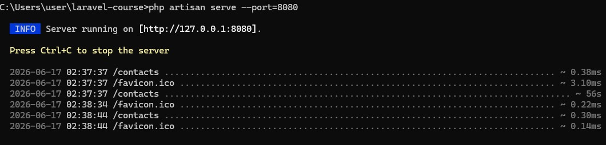

# Урок 4. Работа с шаблонами. Шаблонизатор Blade

## Цели практической работы:

Научиться:
- создавать шаблоны blade и переиспользовать их;
- применять вложенные шаблоны на практике;
- передавать динамические данные на страницу;
- использовать директивы.


Что нужно сделать:

1. Создайте новый проект Laravel или откройте уже существующий проект, в который хотите добавить шаблоны.

2. Создайте новую ветку вашего репозитория от корневой (`main` или `master`).

3. В корневом каталоге проекта создайте подкаталог resources/views. Создайте в нём два шаблона: home.blade.php и contacts.blade.php. Вы заполните эти шаблоны позже.

4. В файле routes/web.php создайте необходимые роуты для навигации по страницам и передачи данных:
    - Первый роут — `'/'`, ссылается на корневую страницу проекта. `Route::get` должен возвращать функцию `view`. Первым аргументом передайте шаблон `home`, вторым аргументом — массив данных с ключами `name`, `age`, `position`, `address`. Значения могут быть произвольными.
    - Второй роут — `'/contacts'`, ссылается на одноимённую страницу с контактами. По аналогии с первым роутом верните из роута функцию `view`, передайте шаблон `contacts` и массив с данными — `address`, `post_code`, `email`, `phone`.

5. В директории `views` создайте подкаталог `layouts`, внутри которого поместите шаблон `default.blade.php`:

    

6. Как видно из картинки выше, вам необходимо создать переиспользуемые шаблоны для тегов `<head>`, `<footer>` и `<hеader>`. Для этого в папке `views` создайте подкаталог `includes`, а в ней, по аналогии уже с созданными страницами, — три соответствующих шаблона с произвольной вёрсткой и вложенностью.

7. Вернёмся к страницам `home` и `contacts`:

    

    Внутри директивы @section добавьте базовую HTML-разметку. Для каждой страницы воспользуйтесь директивой @if. Если значение age для страницы home больше 18 лет, выводите простую цифру, в противном случае — предупреждающее сообщение о том, что указанный человек слишком молод. То же самое повторите и со страницей контактов.
    
    Если вместо почты в шаблон приходит пустая строка, выведите сообщение: `«Адрес электронной почты не указан»`.

8. Сделайте коммит изменений с помощью Git и отправьте push в репозиторий.


### Советы и рекомендации:

- При проектировании шаблонов думайте о том, какие участки разметки можно будет переиспользовать позже, вынести в отдельные файлы и компоненты.


### Критерии оценки:

**Принято:**
- выполнены все пункты задания;
- в работе используются указанные инструменты и соблюдены условия;
- код корректно отформатирован по стандартам программирования на PHP;
- скрипт запускается, выводит различные данные на экран, не вызывает ошибок.

**На доработку:**
- выполнены не все обязательные пункты задания;
- задание выполнено с ошибками.


### Как отправить работу на проверку:

Отправьте коммит, содержащий код задания, на ветку `master` в вашем репозитории и пришлите его `URL` (`URL Merge Request’а`) через форму. Репозиторий должен быть `public`.


--- 

### Ход выполнения Практической работы:

1. Подготовка структуры и файлов (Пункты 2, 3, 5, 6)
    - Сначала создадим новую ветку в Git
     ```
     git checkout -b feature/blade-templates
    ```
    - в папке `resources/views/` структура папок и файлов:
    ```
    resources/views/home.blade.php
    resources/views/contacts.blade.php
    resources/views/layouts/default.blade.php
    resources/views/includes/head.blade.php
    resources/views/includes/header.blade.php
    resources/views/includes/footer.blade.php
    ```

2. Наполнение подключаемых файлов (`Includes`) (Пункт 6)
    - `resources/views/includes/head.blade.php`
    ```
    <meta charset="UTF-8">
    <meta name="viewport" content="width=device-width, initial-scale=1.0">
    <title>Мой сайт на Laravel</title>
    <style>
        body { font-family: sans-serif; margin: 0; padding: 0; display: flex; flex-direction: column; min-height: 100vh; }
        .container { width: 80%; margin: 0 auto; flex: 1; }
        header, footer { background: #333; color: #fff; padding: 20px; text-align: center; }
        header a { color: #fff; margin: 0 15px; text-decoration: none; }
        .main { padding: 20px 0; }
        .error-box { background: #ffebeb; color: #b90000; padding: 10px; border: 1px solid #b90000; }
    </style>
    ```
    - `resources/views/includes/header.blade.php`
    ```
    <nav>
        <a href="/">Главная</a> | 
        <a href="/contacts">Контакты</a>
    </nav>
    ```
    - `resources/views/includes/footer.blade.php`
    ```
    <p>&copy; 2026 Продвинутый курс Laravel. Все права защищены.</p>
    ```


3. Главный каркас сайта (`Layout`) (Пункт 5)
    - файл `resources/views/layouts/default.blade.php`:
    ```
     <!doctype html>
    <html>
    <head>
        @include('includes.head')
    </head>
    <body>
    <div class="container">
        <header class="row">
            @include('includes.header')
        </header>
        <div id="main" class="row">
            @yield('content')
        </div>
        <footer class="row">
            @include('includes.footer')
        </footer>
    </div>
    </body>
    </html>
    ```

4. Настройка маршрутов и данных (Пункт 4)
    - `routes/web.php`:
    ```
    use Illuminate\Support\Facades\Route;

    // Первый роут — Главная страница
    Route::get('/', function () {
        return view('home', [
            'name' => 'Иван',
            'age' => 25, // Попробуйте поменять на 15 для проверки условия @if
            'position' => 'Middle Laravel Developer',
            'address' => 'г. Калининград, ул. Ленина, д. 10'
        ]);
    });

    // Второй роут — Контакты
    Route::get('/contacts', function () {
        return view('contacts', [
            'address' => 'г. Калининград, ул. Ленина, д. 10',
            'post_code' => '236000',
            'email' => '', // Сделайте пустой строкой для проверки задания
            'phone' => '+7 (999) 123-45-67'
        ]);
    });
    ```

5. Страницы `Home` и `Contacts` с директивами `@if` (Пункт 7)
    - `resources/views/home.blade.php`:
    ```
     @extends('layouts.default')

    @section('content')
        <h1>Главная страница</h1>
        <p><strong>Имя:</strong> {{ $name }}</p>
        <p><strong>Должность:</strong> {{ $position }}</p>
        <p><strong>Адрес:</strong> {{ $address }}</p>

        <p><strong>Возраст:</strong> 
            @if($age > 18)
                {{ $age }}
            @else
                <span class="error-box">Указанный человек слишком молод!</span>
            @endif
        </p>
    @stop
    ```
    - `resources/views/contacts.blade.php`:
    ```
    @extends('layouts.default')

    @section('content')
        <h1>Контакты</h1>
        <p><strong>Адрес:</strong> {{ $address }}</p>
        <p><strong>Почтовый индекс:</strong> {{ $post_code }}</p>
        <p><strong>Телефон:</strong> {{ $phone }}</p>

        <p><strong>Email:</strong> 
            @if(!empty($email))
                {{ $email }}
            @else
                <span class="error-box">Адрес электронной почты не указан.</span>
            @endif
        </p>
    @stop
    ```

6. Проверка и фиксация в `Git` (Пункт 8)
    - Запустить локальный сервер: `cmd`
    ```
    php artisan serve --port=8080
    ```

    

    - открыть в браузере ссылки http://localhost:8080/ и http://localhost:8080/contacts. 

    - Сохраните код в Git: `cmd` 
    ```
    git add .
    ```

    ```
    git commit -m "feat: implement Blade templates layout, includes and conditional directives"
    ```    

    ```
    git push origin feature/blade-templates
    ```