# Урок 5. Обработка запроса (Request)

## Цели практической работы:
Научиться:

— использовать класс `Laravel Request` на практике;
— получать параметры запроса из полей ввода и адресной строки;
— передавать данные в формате JSON из полей ввода в класс `Laravel Request`.

Что нужно сделать:

В этой практической работе вы будете получать данные из формы и обрабатывать их в контроллере с помощью встроенных методов класса `Illuminate\Http\Request`.

1. В соответствующих каталогах создайте три файла:
- `blade-шаблон` для создания пользовательских инпутов;
- `EmployeeController` для обработки полученных данных из полей формы;
- `Route` для создания динамического роутинга для отдельного работника и передачи параметра `id` из адресной строки.

2. В `blade-шаблоне` создайте форму, которая будет отправлять данные о работнике.
    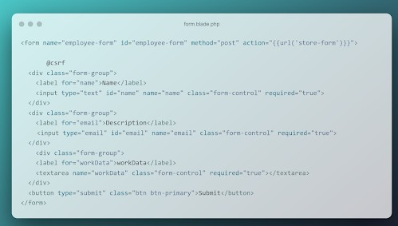

    По аналогии с приведённым выше примером создайте ещё несколько полей ввода. Например, поля `«Фамилия работника»`, `«Занимаемая должность»` и `«Адрес проживания»`. Обратите внимание, что у всех полей формы есть атрибут `required=”true”`. Это важно для полноты получаемых данных от клиента к серверу.

3. Создайте новый контроллер с названием `EmployeeController`. Напомним, что создавать контроллер нужно из консоли с помощью команды:
    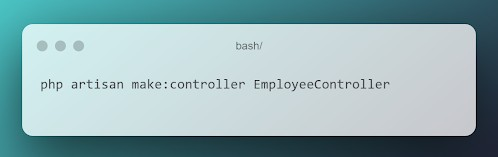

4. Внутри контроллера создайте функцию store, которая будет инициализировать соответствующие переменные и сохранять в них данные из вашей формы:
    
    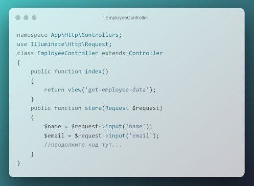

    Добавьте все необходимые переменные в соответствии с вашими полями. Обратите внимание, что мы также создали функцию index, которая просто возвращает необходимый view.

5. Как и в предыдущих занятиях, создайте необходимые роуты в файле web.php:
    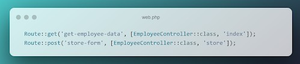


6. В файле web.php добавьте ещё один роут с внедрением зависимости параметров запроса в виде id:
    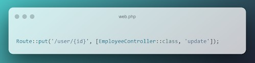


7. Добавьте соответствующий метод в созданный ранее контроллер:
    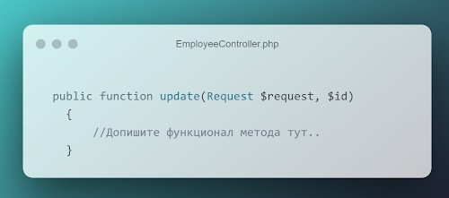

    Добавьте новую переменную id. Поместите в неё id из параметров запроса, обновите данные о пользователе: name, email и так далее.

8. Создайте две новые функции `getPath()`, `getUrl()`, в которых необходимо получить и записать в переменную путь и URL запроса. Для этого воспользуйтесь встроенными в класс `Request` методами `$request->path()` и `$request->url()`;

    Данные методы можно вызывать внутри других методов — update и store, чтобы получать служебную информацию о запросе.

9. В форму ввода добавьте новое текстовое поле textarea, куда необходимо передавать данные в формате JSON, например:
    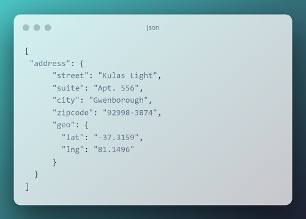


10. Обновите функции store и update. Преобразуйте полученный из запроса JSON в переменную PHP. Для этого воспользуйтесь методом json_decode().

11. Создайте произвольное количество новых php переменных, в которые поместите отдельные поля из пришедших данных в формате JSON. Например:
    


### Критерии оценки

**Принято:**
- выполнены все пункты работы;
- в работе используются указанные инструменты и соблюдены все пункты задания;
- код корректно отформатирован по стандартам программирования на PHP;
- скрипт запускается, выводит различные данные на экран, не вызывает ошибок.

**На доработку:** работа выполнена не полностью или с ошибками.

### Как отправить работу на проверку:
Отправьте коммит, содержащий код задания, на ветку master в вашем репозитории и пришлите его URL (URL Merge Request’а) через форму. Репозиторий должен быть `public`.


--- 

### Ход выполнения Практической работы:


1. Создание файлов и контроллера (Пункты 1, 3)
    новый контроллер: `cmd`
    ```
    php artisan make:controller EmployeeController
    ```
    - файл `blade-шаблона` по пути `resources/views/get-employee-data.blade.php`


2. Верстка формы с текстовым полем для JSON (Пункты 2, 9)
    -  файл `get-employee-data.blade.php`:
    ```
      <!DOCTYPE html>
    <html lang="ru">
    <head>
        <meta charset="UTF-8">
        <title>Добавление работника</title>
        <style>
            body { font-family: Arial, sans-serif; margin: 30px; background: #f4f7f6; }
            .form-group { margin-bottom: 15px; }
            label { display: block; margin-bottom: 5px; font-weight: bold; }
            input, textarea { width: 100%; max-width: 400px; padding: 8px; border: 1px solid #ccc; border-radius: 4px; }
            textarea { height: 100px; }
            button { padding: 10px 15px; background: #28a745; color: white; border: none; border-radius: 4px; cursor: pointer; }
        </style>
    </head>
    <body>
        <h2>Форма добавления работника</h2>
        
        <form name="employee-form" id="employee-form" method="POST" action="{{ url('store-form') }}">
            @csrf
            
            <div class="form-group">
                <label for="name">Имя работника:</label>
                <input type="text" id="name" name="name" required="true">
            </div>

            <div class="form-group">
                <label for="last_name">Фамилия работника:</label>
                <input type="text" id="last_name" name="last_name" required="true">
            </div>

            <div class="form-group">
                <label for="position">Занимаемая должность:</label>
                <input type="text" id="position" name="position" required="true">
            </div>

            <div class="form-group">
                <label for="email">Email:</label>
                <input type="email" id="email" name="email" required="true">
            </div>

            <div class="form-group">
                <label for="workData">Служебные данные (JSON-формат):</label>
                <textarea id="workData" name="workData" required="true">[{"address": {"street": "Kulas Light", "city": "Gwenborough"}}]</textarea>
            </div>

            <button type="submit">Submit</button>
        </form>
    </body>
    </html>
    ```

3. Реализация логики в `EmployeeController` (Пункты 4, 7, 8, 10, 11)
    - файл `app/Http/Controllers/EmployeeController.php` 
    - напишем методы получения путей, метод отображения `index`, а также `store` и `update` с полной обработкой входящих инпутов и JSON:
    ```
     <?php

    namespace App\Http\Controllers;

    use Illuminate\Http\Request;

    class EmployeeController extends Controller
    {
        // Отображение формы (Пункт 4)
        public function index()
        {
            return view('get-employee-data');
        }

        // Служебные методы получения путей (Пункт 8)
        private function getPath(Request $request)
        {
            return $request->path();
        }

        private function getUrl(Request $request)
        {
            return $request->url();
        }

        // Обработка создания формы (Пункты 4, 8, 10, 11)
        public function store(Request $request)
        {
            // 1. Получаем обычные поля
            $name = $request->input('name');
            $lastName = $request->input('last_name');
            $position = $request->input('position');
            $email = $request->input('email');

            // 2. Получаем служебные данные
            $requestPath = $this->getPath($request);
            $requestUrl = $this->getUrl($request);

            // 3. Декодируем и обрабатываем JSON из textarea
            $rawJson = $request->input('workData');
            $decodedData = json_decode($rawJson, true);

            // Извлекаем вложенное поле из массива
            $city = $decodedData[0]['address']['city'] ?? 'Не указан';

            // Выводим результат в браузер для проверки
            return response()->json([
                'message' => 'Данные успешно обработаны в методе STORE',
                'meta' => [
                    'path' => $requestPath,
                    'url' => $requestUrl,
                ],
                'employee' => [
                    'full_name' => $lastName . ' ' . $name,
                    'position' => $position,
                    'email' => $email,
                    'city_from_json' => $city,
                ]
            ]);
        }

        // Эмуляция обновления по ID (Пункты 7, 8, 10)
        public function update(Request $request, $id)
        {
            $requestPath = $this->getPath($request);
            
            $rawJson = $request->input('workData');
            $decodedData = json_decode($rawJson, true);
            $street = $decodedData[0]['address']['street'] ?? 'Не указана';

            return response()->json([
                'message' => 'Данные успешно обновлены в методе UPDATE',
                'target_id' => $id,
                'meta' => [
                    'path' => $requestPath,
                ],
                'updated_fields' => [
                    'name' => $request->input('name'),
                    'email' => $request->input('email'),
                    'street_from_json' => $street
                ]
            ]);
        }
    }
    ```

4. Настройка роутинга (Пункты 1, 5, 6)
    - файл `routes/web.php`:
    ```
    use App\Http\Controllers\EmployeeController;

    // 1. Показ формы (GET)
    Route::get('get-employee-data', [EmployeeController::class, 'index']);

    // 2. Обработка формы (POST)
    Route::post('store-form', [EmployeeController::class, 'store']);

    // 3. Динамический роутинг обновления по ID (PUT)
    Route::put('/user/{id}', [EmployeeController::class, 'update']);
    ```

5. Запуск и тестирование приложения
    - локальный сервер: `cmd`
    ```
    php artisan serve --port=8080
    ```
    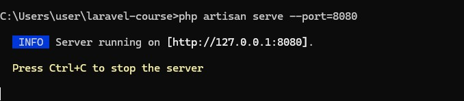


    - запуск в браузере страницы: `http://localhost:8080/get-employee-dat`

    - Тест отправки данных (Метод `STORE`)
    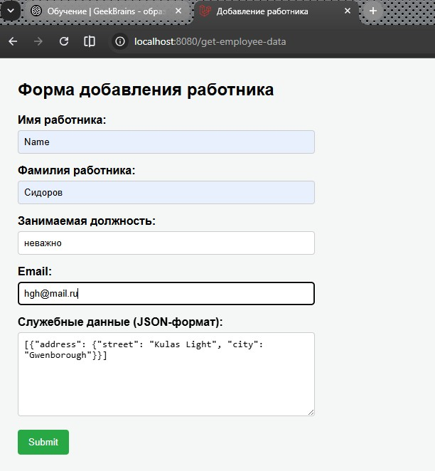

    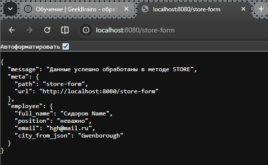

    - Тестдинамического роута `UPDATE` по `ID`:
    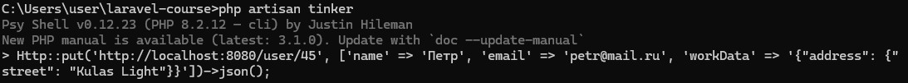

