# Урок 6. Работа с формами

## Цели практической работы:

Научиться:

- связывать данные модели с полями формы;
- обеспечивать безопасность формы с помощью CSRF-токенов;
- валидировать поля формы;
- использовать семантически правильные и релевантные элементы управления формой.

Что нужно сделать:

В этой практической работе вы создадите форму по добавлению новой книги в книжный каталог. Форма будет создаваться внутри шаблона. Данные из формы будут записываться в соответствующие поля базы данных с помощью модели `Eloquent`.

1. Внутри директории `resources/view` корневого каталога проекта создайте новый `блейд-шаблон` с именем `form.blade.php`.
    Пример формы:
    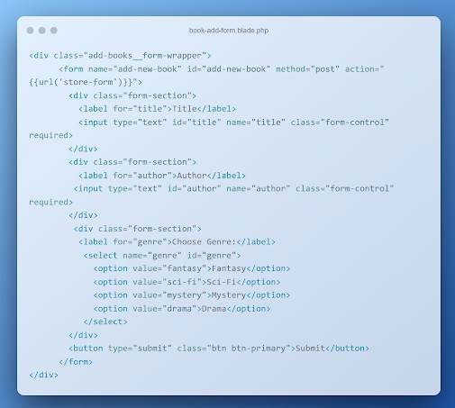

    В примере выше продемонстрирована простая форма для добавления новой записи о книге. В ней указаны поля с названием книги, именем автора, а также жанр, который можно выбрать из списка. Вы также можете добавить произвольные поля, чтобы сделать данные из формы более комплексными и приближенными к реальности.

2. Чтобы защитить данные формы от межсайтовой подделки запроса, добавьте внутрь формы `CSRF` токен. Напомним, сделать этом можно с помощью директивы `@csrf` или скрытого поля `input`:
    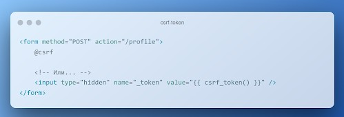


3. Свяжите данные полей формы с моделью Laravel. Для этого создайте новую модель. Сделать это можно из командной строки с помощью artisan-команды:
    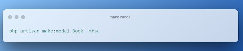

    Напомним, что флаг -mfsc создаст модель, наполнитель, контроллер и файл миграции.

4. Чтобы данные из формы корректно записывались в соответствующие поля базы данных, опишите схему базы данных в методе up():
    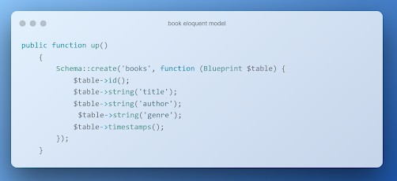

    Чтобы в базе данных появились соответствующие поля, не забудьте повторно запустить миграции в базе данных, воспользовавшись соответствующей командой artisan.

5. Внутри файла /routes/web.php опишите новый роут (метод GET), который будет вызывать метод index контроллера BookController по url /index. Также добавьте роут с методом POST, который будет вызывать метод store того же контроллера BookController с url** /store**

6. Опишите метод index внутри контроллера BookController. Метод должен возвращать представление формы в браузере.

7. Опишите метод store(). Прежде чем сохранить данные внутри модели, проведите валидацию с помощью метода $request->validate(). Правила для валидации:
- все поля обязательны к заполнению, без пустых строк и пробелов в качестве единственного значения;
- максимальное число символов в имени автора — 100, в названии книги — 255;
- название книги должно быть уникальным значением в моделе Book.
    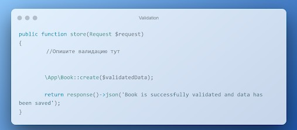

8. Добавьте обработку ошибок при некорректной валидации.
    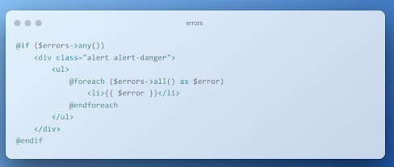


### Критерии оценки:

**Принято:**
- выполнены все пункты работы;
- все значения из полей формы приходят и обрабатываются в контроллере, сохраняются в базе;
- поля корректно валидируются согласно требованиям;
- при некорректной валидации на странице пользователю выводится информация об ошибках;
- код корректно отформатирован по стандартам программирования на PHP;
- скрипт запускается, выводит различные данные на экран, не вызывает ошибок.

**На доработку:** работа выполнена не полностью или с ошибками.

### Как отправить работу на проверку:

Отправьте коммит, содержащий код задания, на ветку master в вашем репозитории и пришлите его URL (URL Merge Request’а) через форму. Репозиторий должен быть public.


--- 

### Ход выполнения Практической работы:

1. Создание модели, миграции и контроллера (Пункт 3)

    - команда для создания сущности книги: `cmd`
    ```
    php artisan make:model Book -mfsc
    ```
    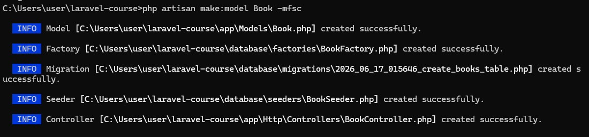


2. Описание схемы базы данных (Пункт 4)
    - папка `database/migrations/`, файл миграции книг. Метод `up()`:
    ```
    public function up(): void
    {
        Schema::create('books', function (Blueprint $table) {
            $table->id();
            $table->string('title')->unique(); // Название должно быть уникальным
            $table->string('author');
            $table->string('genre');
            $table->timestamps();
        });
    }
    ``` 
    - запуск миграции в терминале, чтобы создать таблицу в MySQL (порт 3308): `cmd`
    ```
    php artisan migrate
    ```

    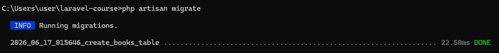


3. Добавление свойства `$fillable` в модель `Book`
    - Чтобы Laravel разрешил массовое заполнение полей при сохранении данных через метод `Book::create()`, их нужно разрешить внутри модели.
    -  Добавление массива `$fillable` в файл `app/Models/Book.php`:
    ```
    <?php

    namespace App\Models;

    use Illuminate\Database\Eloquent\Model;

    class Book extends Model
    {
        protected $fillable = ['title', 'author', 'genre'];
    }
    ```

4. Создание блейд-шаблона формы с выводом ошибок (Пункты 1, 2, 8)
    - В папке `resources/views/` создан новый файл `book-form.blade.php`.
    - добавлена директива `@csrf` для безопасности и блок отображения ошибок валидации в самом верху:
     ```
     <!DOCTYPE html>
    <html lang="ru">
    <head>
        <meta charset="UTF-8">
        <title>Добавление книги</title>
        <style>
            body { font-family: Arial, sans-serif; margin: 40px; background: #f4f7f6; }
            .form-wrapper { max-width: 500px; background: white; padding: 30px; border-radius: 8px; box-shadow: 0 4px 6px rgba(0,0,0,0.1); margin: 0 auto; }
            .form-section { margin-bottom: 20px; }
            label { display: block; margin-bottom: 8px; font-weight: bold; }
            input[type="text"], select { width: 100%; padding: 10px; border: 1px solid #ccc; border-radius: 4px; box-sizing: border-box; }
            button { width: 100%; padding: 12px; background: #007bff; color: white; border: none; border-radius: 4px; cursor: pointer; font-size: 16px; }
            button:hover { background: #0056b3; }
            .alert-danger { background: #ffebeb; color: #b90000; padding: 15px; border: 1px solid #b90000; border-radius: 4px; margin-bottom: 20px; }
            .alert-danger ul { margin: 0; padding-left: 20px; }
        </style>
    </head>
    <body>

    <div class="form-wrapper">
        <h2>Добавить книгу в каталог</h2>

        <!-- Блок вывода ошибок валидации (Пункт 8) -->
        @if ($errors->any())
            <div class="alert-danger">
                <ul>
                    @foreach ($errors->all() as $error)
                        <li>{{ $error }}</li>
                    @endforeach
                </ul>
            </div>
        @endif

        <form name="add-new-book" id="add-new-book" method="POST" action="{{ url('/store') }}">
            @csrf <!-- Токен защиты (Пункт 2) -->

            <div class="form-section">
                <label for="title">Title</label>
                <input type="text" id="title" name="title" value="{{ old('title') }}" class="form-control" required>
            </div>

            <div class="form-section">
                <label for="author">Author</label>
                <input type="text" id="author" name="author" value="{{ old('author') }}" class="form-control" required>
            </div>

            <div class="form-section">
                <label for="genre">Choose Genre:</label>
                <select name="genre" id="genre">
                    <option value="Fantasy" {{ old('genre') == 'Fantasy' ? 'selected' : '' }}>Fantasy</option>
                    <option value="Sci-Fi" {{ old('genre') == 'Sci-Fi' ? 'selected' : '' }}>Sci-Fi</option>
                    <option value="Mystery" {{ old('genre') == 'Mystery' ? 'selected' : '' }}>Mystery</option>
                    <option value="Drama" {{ old('genre') == 'Drama' ? 'selected' : '' }}>Drama</option>
                </select>
            </div>

            <button type="submit" class="btn btn-primary">Submit</button>
        </form>
    </div>

    </body>
    </html>
    ```

5. Написание логики в `BookController` (Пункты 6, 7)


    

    -  файл `app/Http/Controllers/BookController.php`. Метод `index` для показа формы и метод `store` со строгой валидацией входящих данных перед сохранением в БД:
    ```
    <?php

    namespace App\Http\Controllers;

    use App\Models\Book;
    use Illuminate\Http\Request;

    class BookController extends Controller
    {
        // Показ формы в браузере (Пункт 6)
        public function index()
        {
            return view('book-form');
        }

        // Валидация и сохранение данных (Пункт 7)
        public function store(Request $request)
        {
            // Выполняем валидацию по правилам из задания (Пункты 7 и 8)
            $validatedData = $request->validate([
                'title' => 'required|string|max:255|unique:books,title', 
                'author' => 'required|string|max:100',
                'genre' => 'required|string'
            ], [
                // Кастомные сообщения об ошибках на русском языке
                'title.required' => 'Поле "Название книги" обязательно для заполнения.',
                'title.max' => 'Название книги не должно превышать 255 символов.',
                'title.unique' => 'Книга с таким названием уже существует в каталоге.',
                'author.required' => 'Поле "Автор" обязательно для заполнения.',
                'author.max' => 'Имя автора не должно превышать 100 символов.',
            ]);

            // Сохраняем проверенные данные в базу данных с помощью Eloquent
            \App\Models\Book::create($validatedData);

            // Возвращаем JSON-ответ об успешном сохранении (Пункт 7)
            return response()->json([
                'status' => 'success',
                'message' => 'Book is successfully validated and data has been saved'
            ]);
        }
    }
    ```

6. Настройка маршрутов (Пункт 5)
    - файл `routes/web.php`:
    ```
    use App\Http\Controllers\BookController;

    // Маршрут для отображения формы (GET)
    Route::get('/index', [BookController::class, 'index']);

    // Маршрут для обработки формы (POST)
    Route::post('/store', [BookController::class, 'store']);
    ```

7. Запуск и тестирование
    - локальный сервер: `cmd`
    ```
    php artisan serve --port=8080
    ```
    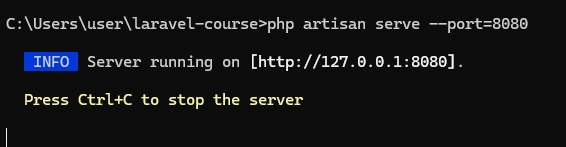


    - запуск в браузере страницы: `http://localhost:8080/index`

    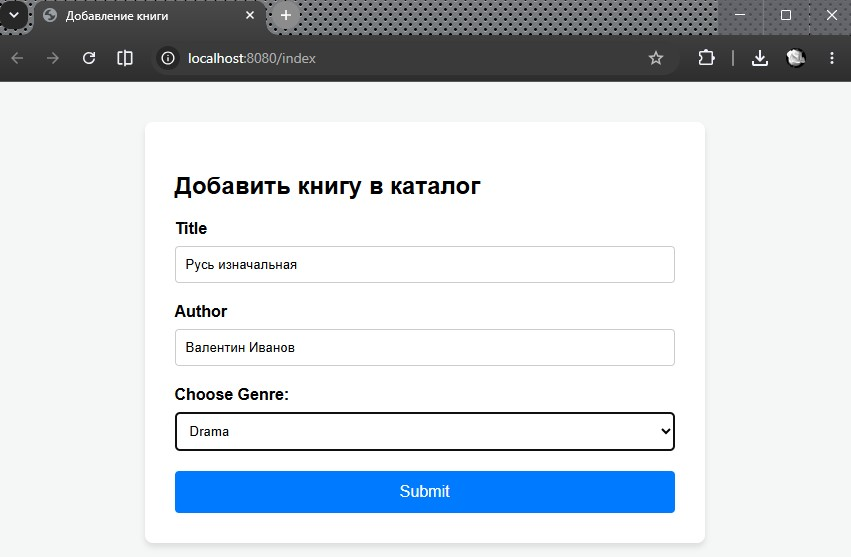


    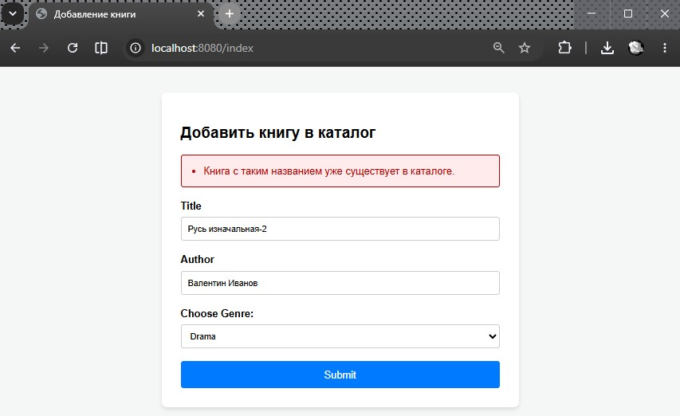


