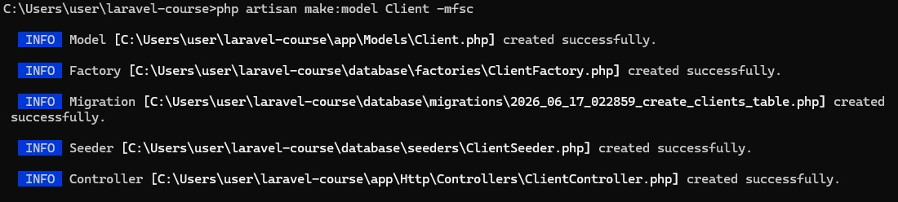
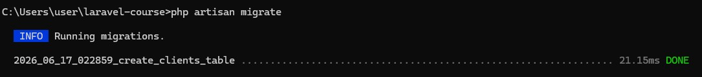
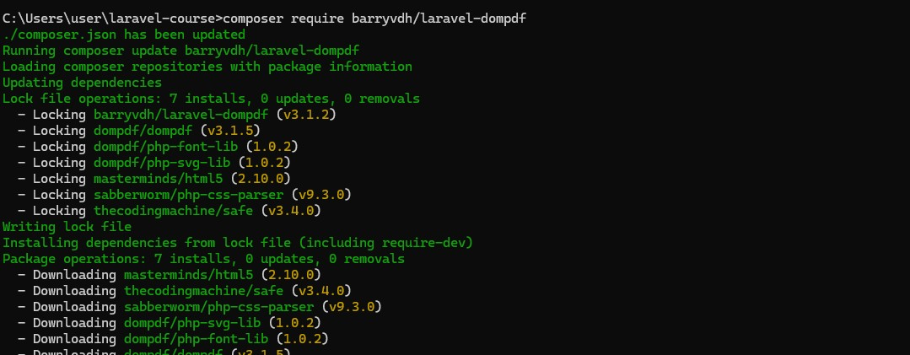
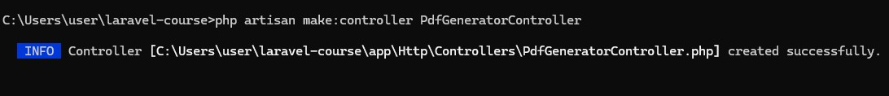
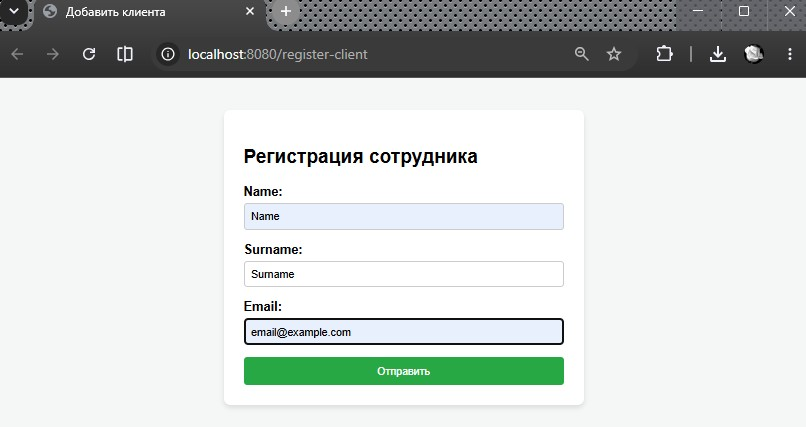
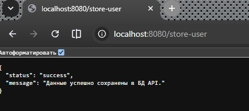
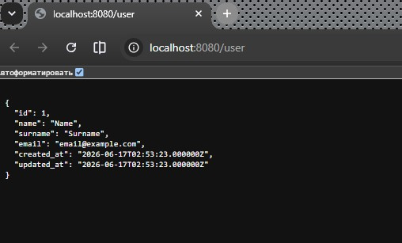
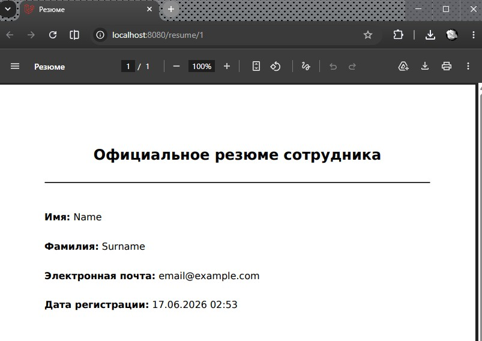

# Урок 7. Формирование ответа (Response)

Реализация практической работы урока согласно [заданным условиям и алгоритмам](image/lesson_07/Урок%207.%20Формирование%20ответа%20(Response).pdf)


--- 

### Ход выполнения Практической работы:


1. Создание модели и настройка базы данных (Пункт 2)
    - команда создания модели, миграции и контроллера:`cmd`
        ```
        php artisan make:model Client -mfsc
        ```
        (Модель создана под названием `Client`, чтобы не перезаписывать системные файлы авторизации Laravel).
    
    

    - файл миграции в `database/migrations/` (`xxxx_create_clients_table.php`):
        ```
        public function up(): void
        {
            Schema::create('clients', function (Blueprint $table) {
                $table->id();
                $table->string('name');
                $table->string('surname');
                $table->string('email')->unique();
                $table->timestamps();
            });
        }
        ``` 

    - команда миграции в консоли `cmd`
        ```
        php artisan migrate
    ```

    


    - `app/Models/Client.php` - разрешение массового заполнения полей:
        ```
        protected $fillable = ['name', 'surname', 'email'];
        ```  


2. Установка библиотеки `DOMPDF` (Пункт 7)

    - Для сборки PDF-файлов нужен пакет `laravel-dompdf`.
    - команда установки в консоли:`cmd`
        ```
        composer require barryvdh/laravel-dompdf
        ```
        
        


    - !!! Важное примечание для `Laravel 11`: в актуальных версиях фреймворка пакеты регистрируются автоматически! Шаг с ручным добавлением провайдеров в `config/app.php` можно пропустить

    


3. Создание blade-шаблона формы и резюме (Пункт 4, 10)
    - шаблоны в папке `resources/views/`
    - `resources/views/client-form.blade.php` — форма для отправки данных
        ```
        <!DOCTYPE html>
        <html lang="ru">
        <head>
            <meta charset="UTF-8">
            <title>Добавить клиента</title>
            <style>
                body { font-family: Arial, sans-serif; margin: 40px; background: #f4f7f6; }
                .form-box { max-width: 400px; margin: 0 auto; background: white; padding: 25px; border-radius: 8px; box-shadow: 0 4px 6px rgba(0,0,0,0.1); }
                .form-group { margin-bottom: 15px; }
                label { display: block; margin-bottom: 5px; font-weight: bold; }
                input { width: 100%; padding: 8px; box-sizing: border-box; border: 1px solid #ccc; border-radius: 4px; }
                button { width: 100%; padding: 10px; background: #28a745; color: white; border: none; border-radius: 4px; cursor: pointer; }
                .errors { background: #ffebeb; color: #b90000; padding: 10px; margin-bottom: 15px; border-radius: 4px; }
            </style>
        </head>
        <body>
        <div class="form-box">
            <h2>Регистрация сотрудника</h2>
            @if ($errors->any())
                <div class="errors">
                    @foreach ($errors->all() as $error) <p style="margin:0;">{{ $error }}</p> @endforeach
                </div>
            @endif
            <form method="POST" action="/store-user">
                @csrf
                <div class="form-group">
                    <label>Name:</label>
                    <input type="text" name="name" required value="{{ old('name') }}">
                </div>
                <div class="form-group">
                    <label>Surname:</label>
                    <input type="text" name="surname" required value="{{ old('surname') }}">
                </div>
                <div class="form-group">
                    <label>Email:</label>
                    <input type="email" name="email" required value="{{ old('email') }}">
                </div>
                <button type="submit">Отправить</button>
            </form>
        </div>
        </body>
        </html>
        ```
    
    - `resources/views/resume.blade.php` — чистый HTML, который превратится в PDF:
        ```
        <!DOCTYPE html>
        <html>
        <head>
            <meta charset="utf-8">
            <title>Резюме</title>
            <style>
                body { font-family: DejaVu Sans, sans-serif; padding: 30px; } /* DejaVu Sans обязателен для поддержки кириллицы в dompdf */
                .header { text-align: center; border-bottom: 2px solid #333; padding-bottom: 10px; }
                .content { margin-top: 20px; font-size: 16px; line-height: 1.6; }
            </style>
        </head>
        <body>
            <div class="header">
                <h2>Официальное резюме сотрудника</h2>
            </div>
            <div class="content">
                <p><strong>Имя:</strong> {{ $name }}</p>
                <p><strong>Фамилия:</strong> {{ $surname }}</p>
                <p><strong>Электронная почта:</strong> {{ $email }}</p>
                <p><strong>Дата регистрации:</strong> {{ $created_at }}</p>
            </div>
        </body>
        </html>
        ```

4. Реализация логики в `ClientController` (Пункт 5, 6)
    - файл `app/Http/Controllers/ClientController.php`. Реализация методов получения всех записей, одной записи по ID и сохранение с валидацией (включая регулярное выражение для почты и лимит 50 символов):
        ```
        <?php

        namespace App\Http\Controllers;

        use App\Models\Client;
        use Illuminate\Http\Request;

        class ClientController extends Controller
        {
            // Показ формы
            public function create()
            {
                return view('client-form');
            }

            // Получение всех записей в JSON (Пункт 6)
            public function index()
            {
                return response()->json(Client::all(), 200, [], JSON_UNESCAPED_UNICODE);
            }

            // Получение одной записи по ID (Пункт 6)
            public function get(Request $request, $id)
            {
                $client = Client::find($id);
                if (!$client) {
                    return response()->json(['error' => 'Client not found'], 404);
                }
                return response()->json($client, 200, [], JSON_UNESCAPED_UNICODE);
            }

            // Сохранение записи с валидацией (Пункт 5)
            public function store(Request $request)
            {
                $validated = $request->validate([
                    'name' => 'required|string|max:50',
                    'surname' => 'required|string|max:50',
                    // Регулярное выражение строго проверяет формат example@mail.com
                    'email' => ['required', 'string', 'regex:/^[a-zA-Z0-9._%+-]+@[a-zA-Z0-9.-]+\.[a-zA-Z]{2,}$/', 'unique:clients,email']
                ]);

                Client::create($validated);

                return response()->json([
                    'status' => 'success',
                    'message' => 'Данные успешно сохранены в БД API.'
                ], 201, [], JSON_UNESCAPED_UNICODE);
            }
        }
        ```

5. Создание контроллера генерации PDF (Пункт 8, 9, 10)
    - генерация отдельного контроллера:`cmd`
        ```
        php artisan make:controller PdfGeneratorController
        ```

        

    - `app/Http/Controllers/PdfGeneratorController.php` - добавление логики загрузки данных из БД и формирования PDF-ответа:
        ```
         <?php

        namespace App\Http\Controllers;

        use App\Models\Client;
        use Barrier\Cc\Facade; // Фасад подгружается автоматически через алиас или импорт
        use Barryvdh\DomPDF\Facade\Pdf;

        class PdfGeneratorController extends Controller
        {
            // Генерация PDF на основе ID пользователя из базы (Пункт 10)
            public function index($id)
            {
                $client = Client::find($id);
                
                if (!$client) {
                    return response('Пользователь не найден', 404);
                }

                // Превращаем модель в массив для передачи в шаблон
                $data = [
                    'name' => $client->name,
                    'surname' => $client->surname,
                    'email' => $client->email,
                    'created_at' => $client->created_at->format('d.m.Y H:i')
                ];

                // Загружаем блейд-шаблон резюме и передаем данные
                $pdf = Pdf::loadView('resume', $data);

                // Возвращаем файл в браузер в виде ответа (Response) (Пункт 9)
                return $pdf->stream('resume_' . $id . '.pdf');
            }
        }
        ```

6. Настройка маршрутов (Пункт 3)
    -  файл `routes/web.php` - четыре эндпоинта под задачи:
        ```
        use App\Http\Controllers\ClientController;
        use App\Http\Controllers\PdfGeneratorController;

        // 1. Показ формы ввода данных
        Route::get('/register-client', [ClientController::class, 'create']);

        // 2. REST API: Получение всех пользователей из БД
        Route::get('/user', [ClientController::class, 'index']);

        // 3. REST API: Получение одного пользователя по id
        Route::get('/user/{id}', [ClientController::class, 'get']);

        // 4. REST API: Запись нового пользователя в базу данных
        Route::post('/store-user', [ClientController::class, 'store']);

        // 5. Формирование ответа: получение резюме в виде PDF-файла
        Route::get('/resume/{id}', [PdfGeneratorController::class, 'index']);
        ```

7. Тестирование работоспособности
    - встроенный сервер:
    ```
    php artisan serve --port=8080
    ```

    


    


    


    
