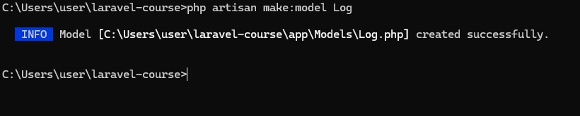
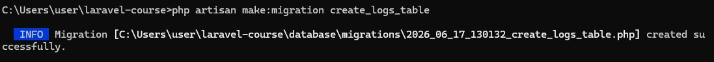
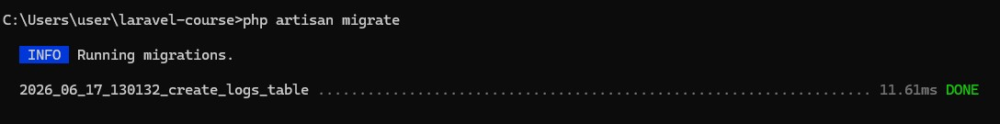
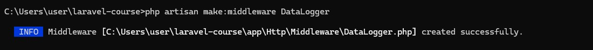
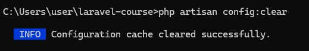
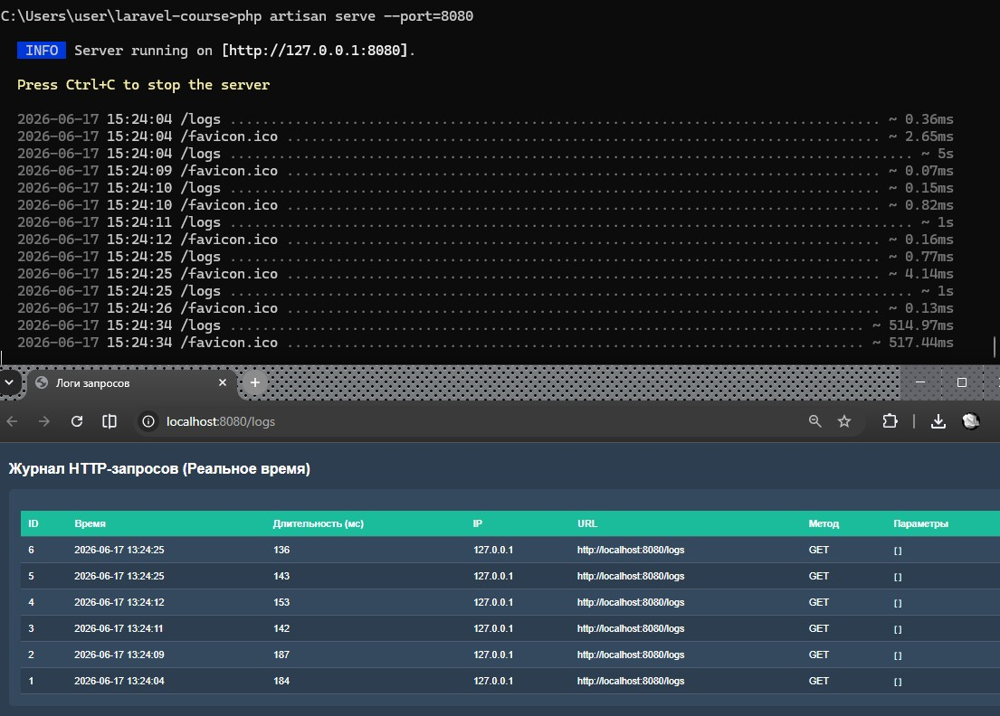

# Урок 8. Сервисы: создание и использование

Реализация практической работы урока согласно [заданным условиям и алгоритмам](image/lesson_08/Урок%208.pdf)


--- 

### Ход выполнения Практической работы:


1. Создание и настройка модели логов
    - Через консоль в папке проекта сгенерируем модель `Log`: `cmd`
        ```
        php artisan make:model Log
        ```
        
        

    - в файле модели `app/Models/Log.php` и отключим встроенные метки времени (`created_at/updated_at`), так как мы будем записывать точное время запроса в кастомное поле `time`:
        ```
        <?php

        namespace App\Models;

        use Illuminate\Database\Eloquent\Model;

        class Log extends Model
        {
            // Отключаем автоматические timestamp-поля Laravel
            public $timestamps = false;

            // Разрешаем массовое заполнение полей
            protected $fillable = ['time', 'duration', 'ip', 'url', 'method', 'input'];
        }
        ```

2. Описание полей и запуск миграции
    - Генерация файла миграции таблицы логов в командной строке `cmd`
        ```
        php artisan make:migration create_logs_table
        ```

        

    - в файле логов папки `database/migrations/` определяем поля `time`, `duration`, `ip`, `url`, `method` и `input`:
        ```
        <?php

        use Illuminate\Database\Migrations\Migration;
        use Illuminate\Database\Schema\Blueprint;
        use Illuminate\Support\Facades\Schema;

        return new class extends Migration
        {
            public function up(): void
            {
                Schema::create('logs', function (Blueprint $table) {
                    $table->bigIncrements('id');
                    $table->datetime('time');
                    $table->integer('duration');
                    $table->string('ip', 100)->nullable();
                    $table->string('url')->nullable();
                    $table->string('method', 10)->nullable();
                    $table->string('input')->nullable();
                });
            }

            public function down(): void
            {
                Schema::dropIfExists('logs');
            }
        };
        ```

    - команда миграции для создания таблицы в базе данных: `cmd`
        ```
        php artisan migrate
        ```
        


3. Создание и программирование Middleware
    - Генерация слоя посредника под названием `DataLogger`: `cmd`
        ```
        php artisan make:middleware DataLogger
        ```
        

    - в файле `DataLogger.php` по пути `app/Http/Middleware/` добавим код, который замеряет скорость ответа, проверяет флаг в `.env` и сохраняет данные в базу или текстовый файл:
        ``` 
        <?php

        namespace App\Http\Middleware;

        use Closure;
        use Illuminate\Http\Request;
        use Symfony\Component\HttpFoundation\Response;
        use App\Models\Log;

        class DataLogger
        {
            // Логика обработки входящего запроса
            public function handle(Request $request, Closure $next): Response
            {
                // Определяем константу времени старта запроса (если еще не создана фреймворком)
                if (!defined('LARAVEL_START')) {
                    define('LARAVEL_START', microtime(true));
                }

                return $next($request);
            }

            // Логика после отправки ответа пользователю
            public function terminate(Request $request, Response $response): void
            {
                // Проверяем, включено ли логирование в .env
                if (env('API_DATALOGGER', true)) {

                    $endTime = microtime(true);
                    // Считаем длительность в миллисекундах
                    $duration = (int)(($endTime - LARAVEL_START) * 1000);

                    // Если опция API_DATALOGGER_USE_DB = true, пишем в базу данных
                    if (env('API_DATALOGGER_USE_DB', true)) {
                        $log = new Log();
                        $log->time = date('Y-m-d H:i:s');
                        $log->duration = $duration;
                        $log->ip = $request->ip();
                        $log->url = $request->fullUrl();
                        $log->method = $request->method();
                        $log->input = json_encode($request->all(), JSON_UNESCAPED_UNICODE);
                        $log->save();
                    } else {
                        // Иначе пишем лог обычным текстом в файл logs/api_datalogger.log
                        $filename = 'api_datalogger_' . date('d-m-y') . '.log';
                        $data = "Time: " . date('Y-m-d H:i:s') . " | ";
                        $data .= "Duration: " . $duration . "ms | ";
                        $data .= "IP: " . $request->ip() . " | ";
                        $data .= "URL: " . $request->fullUrl() . " | ";
                        $data .= "Method: " . $request->method() . " | ";
                        $data .= "Input: " . json_encode($request->all(), JSON_UNESCAPED_UNICODE) . "\n";

                        \Storage::disk('local')->append($filename, $data);
                    }
                }
            }
        }
        ```


4. Регистрация `Middleware` и обновление `.env`
    - Добавляем настройки в `.env`
        ```
        API_DATALOGGER=true
        API_DATALOGGER_USE_DB=true
        ```
    
    - Регистрация в приложении: в `Laravel 11` Файла `Kernel.php` больше нет! Теперь глобальные `Middleware` регистрируются в файле `bootstrap/app.php`
    - в файле `bootstrap/app.php` добавим класс в метод `withMiddleware`


5. Страница логов через `Blade` и эндпоинт
    - Создание файла шаблона `resources/views/logs.blade.php` на чистом Blade (вместо устаревшего PDO-подключения из методички), чтобы использовать силу фреймворка:
        ```
        <!DOCTYPE html>
        <html lang="ru">
        <head>
            <meta charset="UTF-8">
            <title>Логи запросов</title>
            <style>
                body { font-family: sans-serif; margin: 30px; background: #2c3e50; color: #fff; }
                .table-box { width: 100%; overflow-x: auto; background: #34495e; padding: 20px; border-radius: 8px; }
                table { width: 100%; border-collapse: collapse; margin-top: 15px; }
                th, td { padding: 12px; text-align: left; border-bottom: 1px solid #4f5d73; }
                th { background: #1abc9c; }
                tr:nth-child(even) { background: #2c3e50; }
            </style>
        </head>
        <body>
            <h2>Журнал HTTP-запросов (Реальное время)</h2>
            <div class="table-box">
                <table>
                    <thead>
                        <tr>
                            <th>ID</th><th>Время</th><th>Длительность (мс)</th><th>IP</th><th>URL</th><th>Метод</th><th>Параметры</th>
                        </tr>
                    </thead>
                    <tbody>
                        @foreach($logs as $log)
                            <tr>
                                <td>{{ $log->id }}</td>
                                <td>{{ $log->time }}</td>
                                <td>{{ $log->duration }}</td>
                                <td>{{ $log->ip }}</td>
                                <td>{{ $log->url }}</td>
                                <td>{{ $log->method }}</td>
                                <td><code>{{ $log->input }}</code></td>
                            </tr>
                        @endforeach
                    </tbody>
                </table>
            </div>
        </body>
        </html>
        ``` 

    - в файле `routes/web.php` пропишем вывод данных из модели в этот шаблон:
        ```
        use App\Models\Log;

        Route::get('/logs', function () {
            // Получаем последние 50 логов из базы данных
            $logs = Log::orderBy('id', 'desc')->take(50)->get();
            return view('logs', compact('logs'));
        });
        ``` 

 6. Тестирование
    - Сброс кеша конфигурации: `php artisan config:clear`
    - Запуск сервера: `php artisan serve --port=8080`
    - Открытие страницы в браузере по адресу: `http://localhost:8080/logs`. При каждом обновлении страницы таблица дополняется новыми строчками (ведь сам просмотр страницы /logs тоже перехватывается Middleware и записывается в базу в реальном времени).

    
    
    
    
