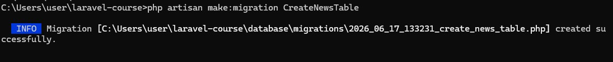
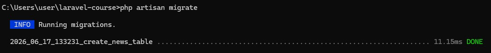
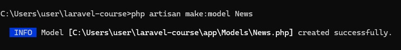
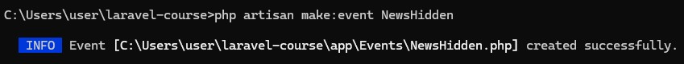
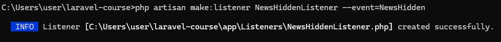
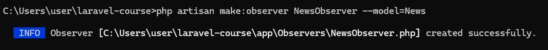
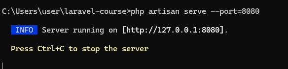
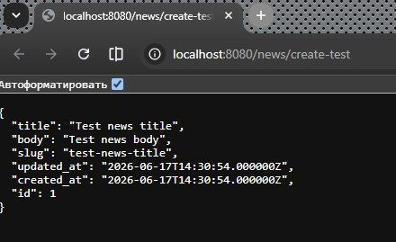
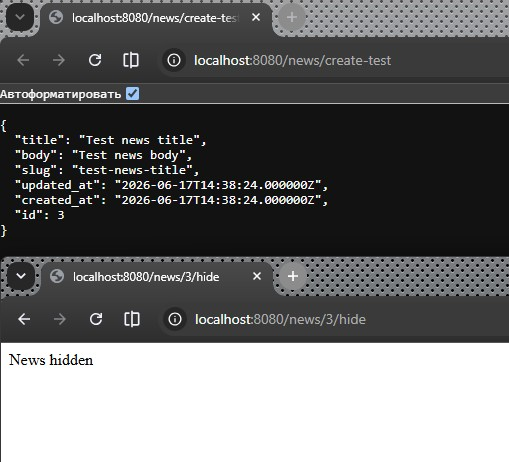
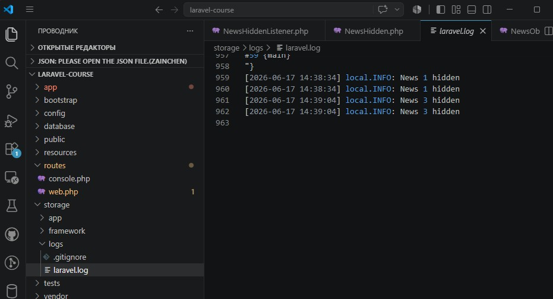

# Урок 9. Работа с событиями

Реализация практической работы урока согласно [заданным условиям и алгоритмам](image/lesson_09/Урок%209.pdf)


--- 

### Ход выполнения Практической работы:


1. Создание миграции и модели новостей (Пункты 3, 4)
    - создание миграции для таблицы новостей через терминал:
        ```
        php artisan make:migration CreateNewsTable
        ```

        

    - в созданном файле папки `database/migrations/` изменим метод `up()`:
        ```
        public function up(): void
        {
            Schema::create('news', function (Blueprint $table) {
                $table->id();
                $table->string('title');
                $table->string('slug')->nullable();
                $table->text('body');
                $table->boolean('hidden')->default(0);
                $table->timestamps();
            });
        }
        ```
    - Применим миграцию к базе данных MySQL через команду в консоли: `cmd`
        ```    
        php artisan migrate
        ```
        
        

    - Создадим модель `News`: `cmd`
        ```
        php artisan make:model News
        ```
        
        

    - в файле `app/Models/News.php` добавим разрешение на массовое заполнение полей:
        ```
        protected $fillable = ['title', 'slug', 'body', 'hidden'];
        ```


2. Создание события и слушателя (Пункты 5, 6)
    - событие `NewsHidden`:`cmd`
        ```
        php artisan make:event NewsHidden
        ```
        
        

    - в файле `app/Events/NewsHidden.php` передача модели `News` в конструктор:
        ```
        <?php

        namespace App\Events;

        use App\Models\News;
        use Illuminate\Foundation\Events\Dispatchable;
        use Illuminate\Queue\SerializesModels;

        class NewsHidden
        {
            use Dispatchable, SerializesModels;

            public $news;

            public function __construct(News $news)
            {
                $this->news = $news;
            }
        }
        ```
    - Создадим слушатель `NewsHiddenListener`:
        ```
        php artisan make:listener NewsHiddenListener --event=NewsHidden
        ```
        
        

    - в файле `app/Listeners/NewsHiddenListener.php` пропишем логику записи в лог:
        ```
        <?php

        namespace App\Listeners;

        use App\Events\NewsHidden;
        use Illuminate\Support\Facades\Log;

        class NewsHiddenListener
        {
            public function handle(NewsHidden $event): void
            {
                Log::info('News ' . $event->news->id . ' hidden');
            }
        }
        ```

3. Регистрация событий и создание Наблюдателя (Пункты 7, 11, 12, 13)
    - В `Laravel 11` класс `EventServiceProvider` удален ради упрощения структуры, а регистрация происходит автоматически или в `AppServiceProvider`. Но мы сделаем регистрацию универсальной, которая сработает в любой версии `Laravel`.
    - Создание класса-наблюдателя `NewsObserver`:
        ```
        php artisan make:observer NewsObserver --model=News
        ```

        

    - в файле `app/Observers/NewsObserver.php` добавим метод `saving` для автоматической генерации слага из названия:
        ```
        <?php

        namespace App\Observers;

        use App\Models\News;
        use Illuminate\Support\Str;

        class NewsObserver
        {
            // Срабатывает автоматически перед созданием или обновлением записи в БД
            public function saving(News $news): void
            {
                $news->slug = Str::slug($news->title);
            }
        }
        ```
    - Регистрация всего функционала: в файле `app/Providers/AppServiceProvider.php` (универсальный провайдер) внутри метода `boot()` зарегистрируем и связь Событие-Слушатель, и Наблюдатель:   
        ```
        <?php

        namespace App\Providers;

        use Illuminate\Support\ServiceProvider;
        use App\Models\News;
        use App\Observers\NewsObserver;
        use App\Events\NewsHidden;
        use App\Listeners\NewsHiddenListener;
        use Illuminate\Support\Facades\Event;

        class AppServiceProvider extends ServiceProvider
        {
            /**
            * Register any application services.
            */
            public function register(): void
            {
                //
            }

            /**
            * Bootstrap any application services.
            */
            public function boot(): void
            {
                // Регистрация события и слушателя (Пункт 7)
                Event::listen(NewsHidden::class, NewsHiddenListener::class);

                // Регистрация наблюдателя (Пункт 12)
                News::observe(NewsObserver::class);
            }
        }
        ```

4. Настройка маршрутов (Пункты 8, 9)
    - в файле `routes/web.php` и добавим роуты для генерации тестовой новости и её скрытия:
        ```
        use App\Models\News;
        use App\Events\NewsHidden;

        // Создание тестовой новости
        Route::get('/news/create-test', function () {
            $news = new News();
            $news->title = 'Test news title';
            $news->body = 'Test news body';
            $news->save(); // Тут сработает Обсервер и заполнит slug

            return $news;
        });

        // Скрытие новости и вызов события
        Route::get('/news/{id}/hide', function ($id) {
            $news = News::findOrFail($id);
            $news->hidden = true;
            $news->save();

            // Вызываем событие скрытия новости
            NewsHidden::dispatch($news);

            return 'News hidden';
        });
        ```

5. Локальное тестирование
    - запуск веб-сервера фреймворка:`cmd`
        ```
        php artisan serve --port=8080
        ```

        


6. Тест Наблюдателя (Автогенерация `slug`)
        
    


7. Тест События и Слушателя (Логирование скрытия)

    


8. Проверка системного лога (laravel.log)      
  
    
