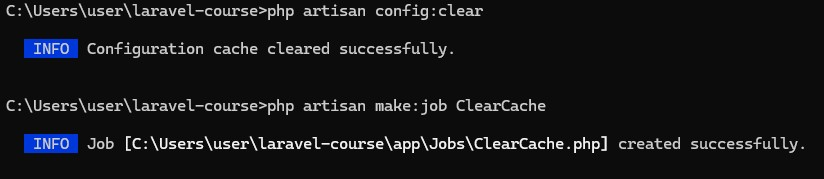
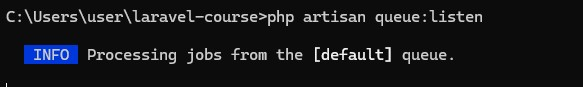
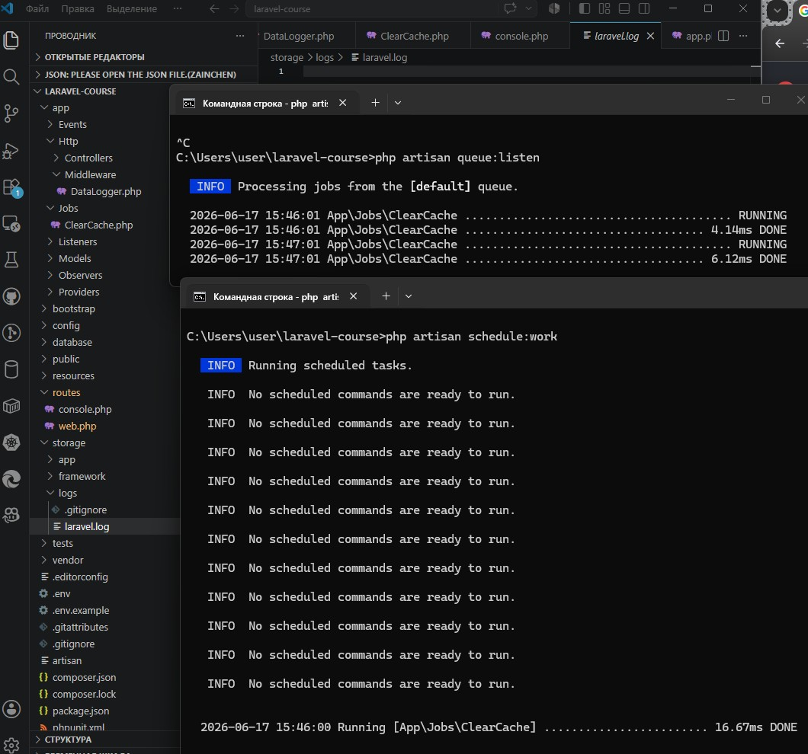

# Урок 10. Встроенные возможности Laravel

Реализация практической работы урока согласно [заданным условиям и алгоритмам](image/lesson_10/Урок%2010.pdf)


--- 

### Ход выполнения Практической работы:

1. Настройка очереди (Пункты 2, 3, 4, 5)
    - Особенность `Laravel 11/12`: Команда `php artisan queue:table` больше не требуется, так как фреймворк по умолчанию имеет встроенную миграцию очередей (файл `xxxx_create_jobs_table.php` уже был успешно создан и применен на нашем 3-м уроке).
    - в файле `.env` изменим значение переменной `QUEUE_CONNECTION` с `sync` на `database`: `iniQUEUE_CONNECTION=database`
    - Сброс кеша конфигурации, чтобы Laravel применил новые настройки очередей: 
    ```
    php artisan config:clear
    ```

2. Создание и написание фоновой задачи (Пункты 6, 7)
    - Сгенерируем класс асинхронной задачи с помощью `Artisan`:`cmd`
        ```
        php artisan make:job ClearCache
        ```
        

    - реализация метода `handle()` в файле `app/Jobs/ClearCache.php`, который будет полностью очищать содержимое главного лог-файла приложения:
        ```
        <?php

        namespace App\Jobs;

        use Illuminate\Contracts\Queue\ShouldQueue;
        use Illuminate\Foundation\Queue\Queueable;
        use Illuminate\Foundation\Bus\Dispatchable;
        use Illuminate\Queue\InteractsWithQueue;
        use Illuminate\Queue\SerializesModels;

        class ClearCache implements ShouldQueue
        {
            use Dispatchable, InteractsWithQueue, Queueable, SerializesModels;

            /**
            * Create a new job instance.
            */
            public function __construct()
            {
                //
            }

            /**
            * Execute the job.
            */
            public function handle(): void
            {
                // Очищаем лог-файл, записывая в него пустую строку (Пункт 7)
                file_put_contents(storage_path('logs/laravel.log'), '');
            }
        }
        ```

3. Подключение задачи к Планировщику (Пункт 8)
    - В методичке указан старый файл `app/Console/Kernel.php`. В современных версиях `Laravel` планировщик задач настраивается прямо в файле конфигурации приложения.
    - Самый простой и надежный способ для Laravel 12 — прописать задачу в `routes/console.php`.  Добавляем ежечасный вызов нашей задачи:
        ```
        <?php

        use Illuminate\Support\Facades\Schedule;
        use App\Jobs\ClearCache;

        // Помещаем вызов фоновой задачи в планировщик на каждый час (Пункт 8)
        Schedule::job(new ClearCache)->hourly();
        ```

4. Тестирование работы планировщика и очередей (Пункты 9, 10)
    - Запуск воркера очередей через консоль: 
        ```
        php artisan queue:listen
        ```

        

    - Запуск планировщика через второе окно консоли:
        ```
        php artisan schedule:work
        ```


        
