# Урок 11. Реализация авторизации 

Реализация практической работы урока согласно [заданным условиям и алгоритмам](image/lesson_11/Урок%2011.pdf)


--- 

### Ход выполнения Практической работы:

1. Установка пакета Laravel Breeze (Пункты 3, 4, 5)
    - В консоли проекта запуск установки `Breeze`:`cmd`
        ```
        composer require laravel/breeze --dev
        ```
        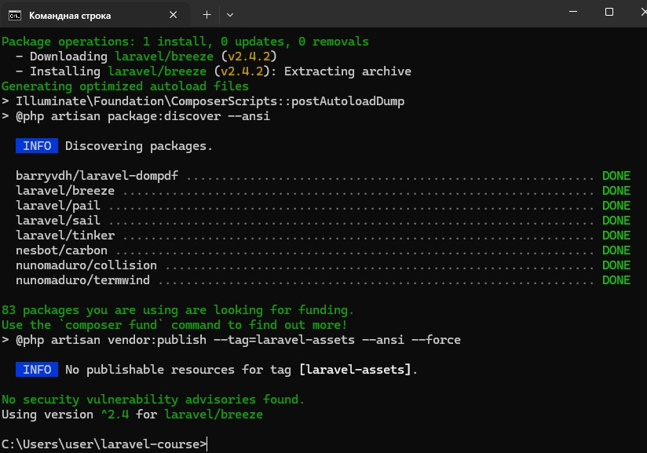
    - Развертывание файлов аутентификации. Для простоты выберем самый первый вариант — Blade с Alpine:`cmd`
        ```
        php artisan breeze:install
        ```
        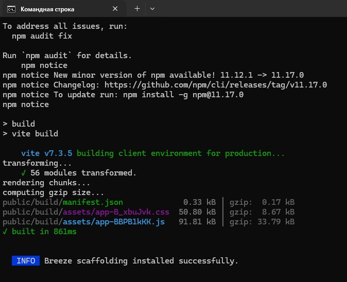

    - Установка и сборка фронтенд-зависимости:`cmd`
        ```
        npm install && npm run dev
        ```


2. Добавление поля `is_admin` в таблицу пользователей (Пункт 10)
    - файл миграции для изменения структуры таблицы `users`
        ```
        php artisan make:migration add_is_admin_to_users_table --table=users
        ```
        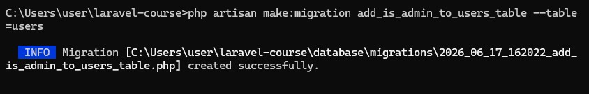

    - добавляем поле `is_admin` в созданный файл папки database/migrations/:
        ```
        public function up(): void
        {
            Schema::table('users', function (Blueprint $table) {
                // Добавляем boolean поле, по умолчанию обычный пользователь (0)
                $table->boolean('is_admin')->default(false)->after('email');
            });
        }

        public function down(): void
        {
            Schema::table('users', function (Blueprint $table) {
                $table->dropColumn('is_admin');
            });
        }
        ```
    - Применим миграцию к MySQL (порт 3308):
        ```
        php artisan migrate
        ```
        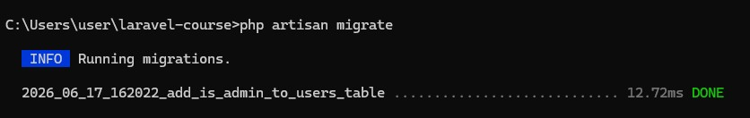


3. Создание Политики Безопасности (Пункты 11, 12)
    - генерация класса политики доступа для модели пользователей:`cmd`
        ```
        php artisan make:policy UserPolicy --model=User
        ```
        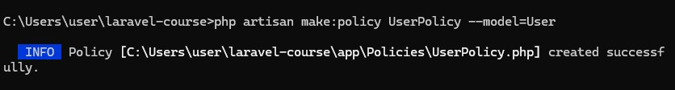
        
    - в созданном файле `app/Policies/UserPolicy.php` пропишем метод `viewAny`, проверяющий статус администратора:
        ```
        <?php

        namespace App\Policies;

        use App\Models\User;

        class UserPolicy
        {
            // Доступ разрешен только если флаг is_admin равен true
            public function viewAny(User $user): bool
            {
                return (bool) $user->is_admin;
            }
        }
        ```
    - Регистрация политики: в Laravel 11/12: Шаг 12 из методички (ручная регистрация в AuthServiceProvider) можно пропустить! Фреймворк автоматически связывает User и UserPolicy благодаря стандартному именованию классов.

4. Написание Контроллера и Авторизации (Пункты 7, 8, 13)
    - генерация контроллера управления пользователями:`cmd`
        ```
        php artisan make:controller UsersController
        ```
        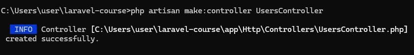
    - добавим метод `index` с проверкой прав через `Gate` (это современный аналог `$this->authorize` из ТЗ) в файле `app/Http/Controllers/UsersController.php`:
        ```
        <?php

        namespace App\Http\Controllers;

        use App\Models\User;
        use Illuminate\Support\Facades\Gate;

        class UsersController extends Controller
        {
            public function index()
            {
                // Проверяем право 'viewAny' на модель User с помощью политик
                Gate::authorize('viewAny', User::class);

                // Если проверка пройдена, возвращаем список пользователей
                return response()->json(User::all(), 200, [], JSON_UNESCAPED_UNICODE);
            }
        }
        ```

5. Настройка роутинга (Пункт 9)
    - в файле `routes/web.php` добавим маршрут `/users`, защитив его стандартным посредником авторизации `auth`, чтобы неаутентифицированные гости сразу перенаправлялись на форму логина:
        ```
        use App\Http\Controllers\UsersController;

        // Маршрут доступен только вошедшим в систему пользователям
        Route::get('/users', [UsersController::class, 'index'])->middleware(['auth']);
        ```

6. Тестирование ролевой модели (Пункт 14)
    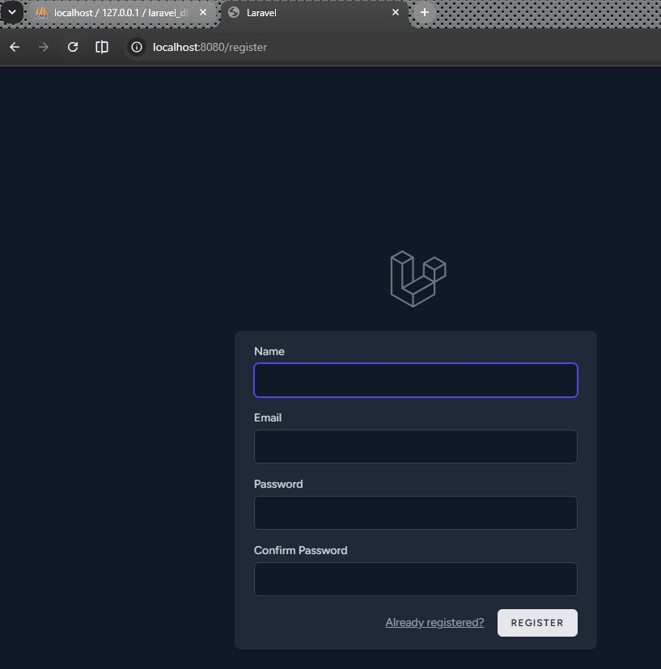

    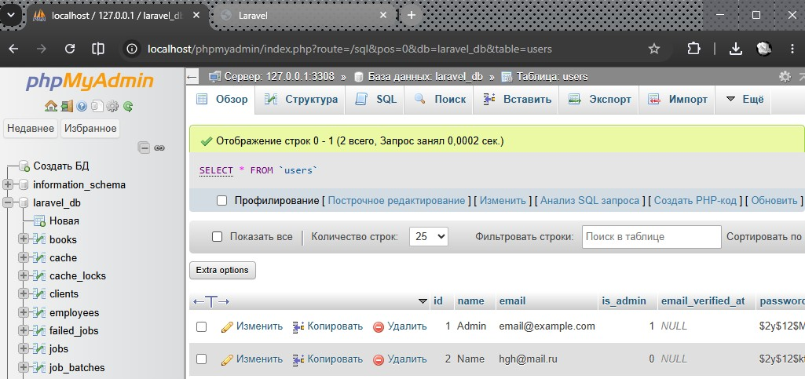

    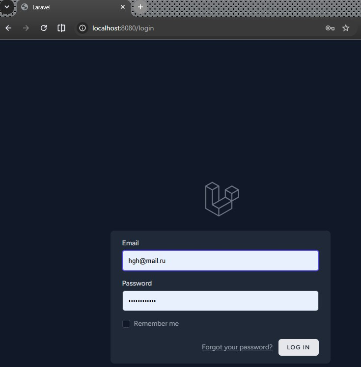

    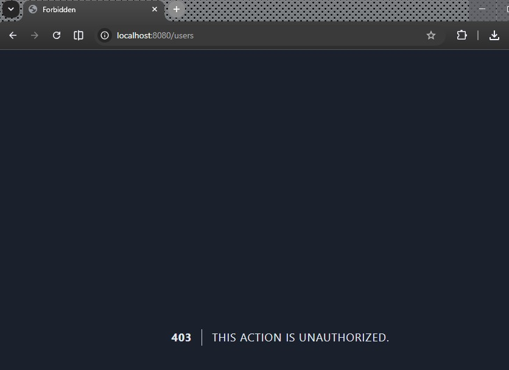

    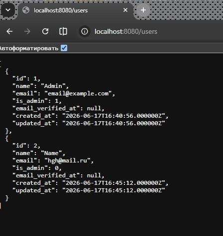

    


