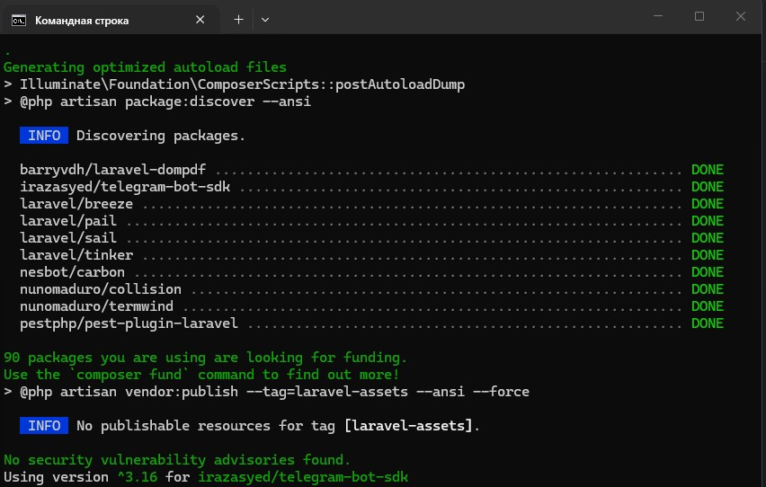
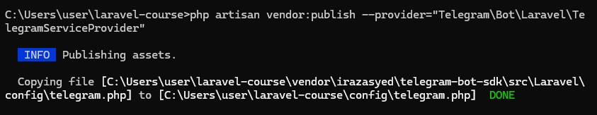
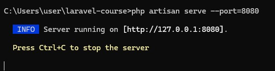
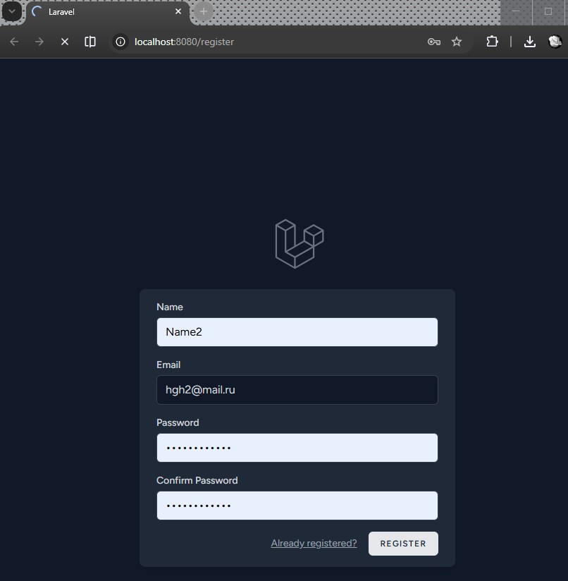
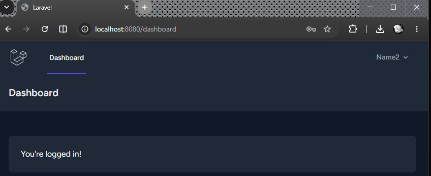

# Урок 12. Интеграция с внешними сервисами

Реализация практической работы урока согласно [заданным условиям и алгоритмам](image/lesson_12/Урок%2012.pdf)


--- 

### Ход выполнения Практической работы:

1. Настройка почты через лог-драйвер (Пункты 4, 5)
    - Чтобы не зависеть от реальных SMTP-паролей Mail.ru или Яндекс, самый быстрый и профессиональный способ — использовать почтовый драйвер `log`. `Laravel` будет имитировать отправку, записывая полные тексты писем в файл `storage/logs/laravel.log`.
    - в файле `.env` корня проекта изменим блок настроек `MAIL_`: 
        ```
        MAIL_MAILER=log
        MAIL_FROM_ADDRESS="admin@example.com"
        MAIL_FROM_NAME="${APP_NAME}"
        ```

2. Создание класса письма и блейд-шаблона (Пункты 6, 7, 8)
    - В терминале проекта сгенерируем класс отправки письма: `cmd`
        ```
        php artisan make:mail Welcome
        ```
    - в созданном файле `app/Mail/Welcome.php` настроим передачу модели `User`
        ```
        <?php

        namespace App\Mail;

        use App\Models\User;
        use Illuminate\Bus\Queueable;
        use Illuminate\Mail\Mailable;
        use Illuminate\Mail\Mailables\Content;
        use Illuminate\Mail\Mailables\Envelope;
        use Illuminate\Queue\SerializesModels;

        class Welcome extends Mailable
        {
            use Queueable, SerializesModels;

            // Объявляем публичное свойство, чтобы оно автоматически было доступно в Blade
            public User $user;

            public function __construct(User $user)
            {
                $this->user = $user;
            }

            public function envelope(): Envelope
            {
                return new Envelope(
                    subject: 'Спасибо за регистрацию!',
                );
            }

            public function content(): Content
            {
                return new Content(
                    view: 'emails.welcome', // Указываем путь к шаблону
                );
            }
        }
        ```
    - Создадим папку `resources/views/emails/` и добавьте в неё файл `welcome.blade.php` с текстом:
        ```
        <p>Добрый день, {{ $user->name }}, спасибо за регистрацию.</p>
        ```

3. Интеграция Telegram SDK и настройки (Пункты 10, 11, 12)
    - Установим официальный `SDK` для работы с `Telegram-ботами`:`cmd`
        ```
        composer require irazasyed/telegram-bot-sdk
        ``` 
        

   
    - в файл `.env` добавим токен бота и ID чата/канала (т.к. нет реального бота, впишем любые тестовые данные для проверки кода):
        ```
        TELEGRAM_BOT_TOKEN="123456789:ABCdefGhIJKlmNoPQRsTUVwxyZ"
        TELEGRAM_CHANNEL_ID="-100123456789"
        ```
    - Опубликуем конфигурационный файл библиотеки, чтобы фасад Telegram стал доступен глобально:`cmd`
        ```
        php artisan vendor:publish --provider="Telegram\Bot\Laravel\TelegramServiceProvider"
        ```
        


4. Внедрение уведомлений в контроллер `Breeze` (Пункты 9, 14)
    - Поскольку в данном проекте используется систему авторизации `Laravel Breeze`, логика сохранения новых пользователей находится в контроллере `RegisteredUserController`.
    - в файл `app/Http/Controllers/Auth/RegisteredUserController.php` добавим импорты фасадов почты, телеграма и класса нашего письма Welcome:
        ```
        use Illuminate\Support\Facades\Mail;
        use Telegram\Bot\Laravel\Facades\Telegram;
        use App\Mail\Welcome;
        ```
    - в метод `store` добавим код отправки email и сообщения в Telegram:
        ```
        // Отправка email-письма пользователю (Пункт 9)
        Mail::to($user->email)->send(new Welcome($user));

        // Отправка уведомления в Telegram-канал (Пункт 14)
        try {
            Telegram::sendMessage([
                'chat_id' => env('TELEGRAM_CHANNEL_ID', ''),
                'parse_mode' => 'html',
                'text' => "<b>Новый пользователь!</b>\nИмя: " . $user->name . "\nEmail: " . $user->email
            ]);
        } catch (\Exception $e) {
            // Пишем ошибку в лог, если токен бота в .env был тестовым, чтобы сайт не падал
            \Log::error('Telegram notification failed: ' . $e->getMessage());
        }
        ```

5. Создание тестового роута Telegram (Пункт 13)
    - в файл `routes/web.php` добавим обязательный тестовый роут из ТЗ:
        ```
        use Telegram\Bot\Laravel\Facades\Telegram;

        Route::get('test-telegram', function () {
            try {
                Telegram::sendMessage([
                    'chat_id' => env('TELEGRAM_CHANNEL_ID', ''),
                    'parse_mode' => 'html',
                    'text' => 'Произошло тестовое событие'
                ]);
            } catch (\Exception $e) {
                return response()->json(['status' => 'error', 'message' => $e->getMessage()]);
            }

            return response()->json([
                'status' => 'success'
            ]);
        });
        ```

6. Тестирование
    

    

    

    
