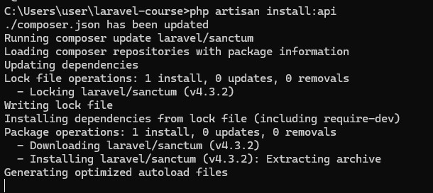
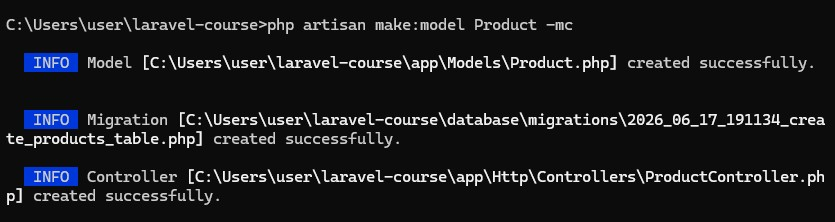
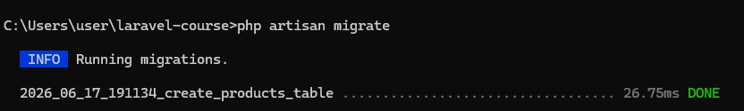
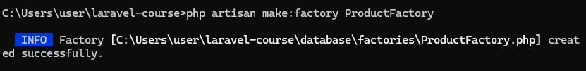
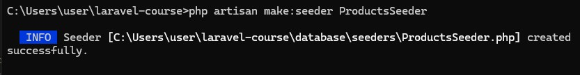
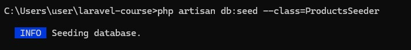
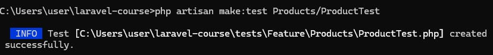
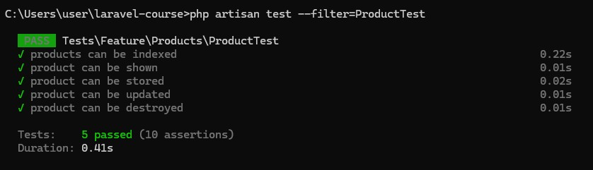

# Урок 13. Тестирование и отладка Laravel-приложений

Реализация практической работы урока согласно [заданным условиям и алгоритмам](image/lesson_13/Урок%2013.pdf)


--- 

### Ход выполнения Практической работы:

1. Генерация сущности и включение API (Пункты 3, 5, 6)
    - Включим поддержку API-маршрутов в проекте (Laravel создаст файл `routes/api.php` автоматически):`cmd`
        ```
        php artisan install:api
        ```

    

    - Сгенерируем модель, миграцию и контроллер для товаров:`cmd`
        ```
        php artisan make:model Product -mc
        ```

    

    - в созданном файле миграции `_create_products_table.php` добавим поля:
        ```
        public function up(): void
        {
            Schema::create('products', function (Blueprint $table) {
                $table->id();
                $table->string('sku')->unique();
                $table->string('name');
                $table->decimal('price', 9, 3);
                $table->timestamps();
            });
        }
        ```
    - Накатим миграцию: `php artisan migrate`

        

    - Добавим в файл `routes/api.php` строку маршрутов:
        ```
        use App\Http\Controllers\ProductController;

        Route::apiResource('products', ProductController::class);
        ```

2. Настройка модели, фабрики и сидера (Пункты 7, 8, 9)
    - В модели `app/Models/Product.php` разрешим массовое заполнение и подключим трейт фабрик:
        ```
        protected $fillable = ['sku', 'name', 'price'];
        ```
    - Сгенерируем фабрику: `php artisan make:factory ProductFactory`.  
        

    - в файле `database/factories/ProductFactory.php` настроим генерацию фейковых данных:
        ```
        public function definition(): array
        {
            return [
                'sku' => $this->faker->unique()->bothify('PROD-####'),
                'name' => $this->faker->word(),
                'price' => $this->faker->randomFloat(3, 10, 1000),
            ];
        }
        ```
    - Сгенерируем сидер: `php artisan make:seeder ProductsSeeder`
        


    - в файле `database/seeders/ProductsSeeder.php` добавим создание 10 товаров:
        ```
        use App\Models\Product;

        public function run(): void
        {
            Product::factory()->count(10)->create();
        }
        ```
    - Подключение трейта HasFactory в модель. В файл `app/Models/Product.php` добавим строчку импорта трейта HasFactory, а также подключим его внутри самого класса модели с помощью ключевого слова `use`

    - Наполним базу данных командой
        ```
        php artisan db:seed --class=ProductsSeeder
        ```
        

3. Реализация `CRUD` в `ProductController` (Пункт 10)
    - добавление методов в файл `app/Http/Controllers/ProductController.php`:
        ```
        <?php

        namespace App\Http\Controllers;

        use App\Models\Product;
        use Illuminate\Http\Request;

        class ProductController extends Controller
        {
            public function index()
            {
                return response()->json(Product::all());
            }

            public function store(Request $request)
            {
                $validated = $request->validate([
                    'sku' => 'required|string|unique:products,sku',
                    'name' => 'required|string',
                    'price' => 'required|numeric',
                ]);

                $product = Product::create($validated);
                return response()->json($product, 201);
            }

            public function show(Product $product)
            {
                return response()->json($product);
            }

            public function update(Request $request, Product $product)
            {
                $validated = $request->validate([
                    'sku' => 'string|unique:products,sku,' . $product->id,
                    'name' => 'string',
                    'price' => 'numeric',
                ]);

                $product->update($validated);
                return response()->json($product);
            }

            public function destroy(Product $product)
            {
                // Физически удаляем товар из базы данных
                $product->delete();

                // Возвращаем правильный статус 204 (No Content) для REST API
                return response()->noContent();
            }
        }
        ```

4. Написание `Feature-тестов` (Пункты 12, 13, 14)
    - Сгенерируем класс теста: `php artisan make:test Products/ProductTest`
             
    - в файле `tests/Feature/Products/ProductTest.php` опишем функции строго по списку ТЗ:
        ```
        <?php

        namespace Tests\Feature\Products;

        use App\Models\Product;
        use Illuminate\Foundation\Testing\RefreshDatabase;
        use Tests\TestCase;

        class ProductTest extends TestCase
        {
            use RefreshDatabase; // Очищает базу данных перед каждым тестом

            public function test_products_can_be_indexed(): void
            {
                Product::factory()->count(3)->create();

                $response = $this->getJson('/api/products');

                $response->assertStatus(200)->assertJsonCount(3);
            }

            public function test_product_can_be_shown(): void
            {
                $product = Product::factory()->create();

                $response = $this->getJson('/api/products/' . $product->id);

                $response->assertStatus(200)->assertJsonPath('sku', $product->sku);
            }

            public function test_product_can_be_stored(): void
            {
                $data = ['sku' => 'TEST-123', 'name' => 'Test Product', 'price' => 99.99];

                $response = $this->postJson('/api/products', $data);

                $response->assertStatus(201);
                $this->assertDatabaseHas('products', ['sku' => 'TEST-123']);
            }

            public function test_product_can_be_updated(): void
            {
                $product = Product::factory()->create();
                $data = ['name' => 'Updated Name'];

                $response = $this->putJson('/api/products/' . $product->id, $data);

                $response->assertStatus(200);
                $this->assertDatabaseHas('products', ['id' => $product->id, 'name' => 'Updated Name']);
            }

            public function test_product_can_be_destroyed(): void
            {
                $product = Product::factory()->create();

                $response = $this->deleteJson('/api/products/' . $product->id);

                $response->assertStatus(204);
                $this->assertDatabaseMissing('products', ['id' => $product->id]);
            }
        }
        ```
    - Запуск выполнения тестов в консоли:`cmd`
        ```
        php artisan test
        ```
        


    
