# Урок 14. Создание администраторской панели

Реализация практической работы урока согласно [заданным условиям и алгоритмам](image/lesson_14/Урок%2014.pdf)

---

# Промежуточная аттестация

--- 

### Ход выполнения Практической работы:

1. Создание моделей и настройка миграций склада (Пункты 3–7)
    - в консоли проекта сгенерируем сущность категорий:`cmd`
        ```
        php artisan make:model Category -m
        ```
        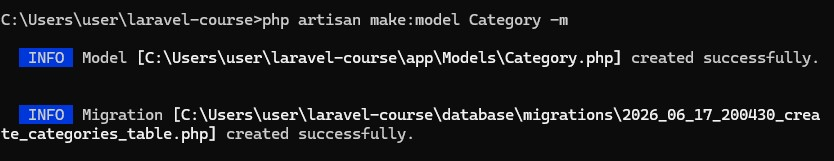
    - в созданном файле миграции `_create_categories_table.php` опишем структуру:
        ```
        public function up(): void
        {
            Schema::create('categories', function (Blueprint $table) {
                $table->id();
                $table->string('name');
                $table->timestamps();
            });
        }
        ```
    - Сгенерируем обновленную модель товаров (контроллер создавать не нужно, так как Voyager берет управление на себя):
        ```
        php artisan make:model Product -m
        ```
        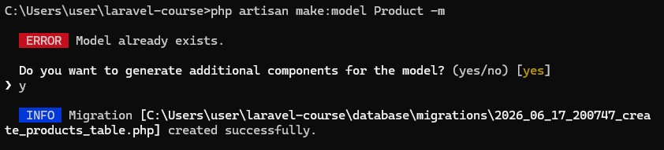

    - в файле миграции `_create_products_table.php` опишем структуру со внешним ключом `category_id`:
        ```
        public function up(): void
        {
            Schema::create('products', function (Blueprint $table) {
                $table->id();
                $table->string('sku')->unique();
                $table->string('name');
                $table->foreignId('category_id')->constrained()->onDelete('cascade'); // Связь с категориями
                $table->timestamps();
            });
        }
        ```
    - Выполним принудительную «свежую» миграцию для пересоздания таблиц склада без конфликтов:
        ```
        php artisan migrate:fresh
        ```
        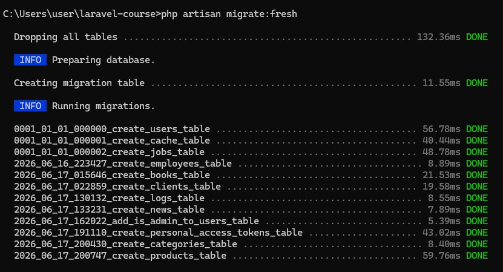

2. Установка и инициализация Voyager (Пункты 8–10)
    - !!! Жесткий конфликт версий не дает установить Voyager, потому что Laravel 12 и Voyager 1.8.0 физически не могут находиться в одном проекте (Voyager требует строго компоненты 11-й версии фреймворка)
    - Развертывание Laravel 11 в новой чистой папке
        ```
        composer create-project laravel/laravel:^11.0 voyager-project --no-security-blocking
        ```
        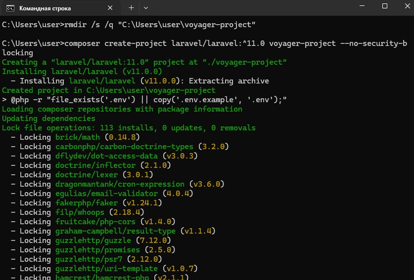


    - Перенаправляем Laravel из SQLite в MySQL 
        ```        
        DB_HOST=127.0.0.1
        DB_PORT=3308
        DB_DATABASE=laravel_db
        DB_USERNAME=root
        DB_PASSWORD=
        ```
    - Создание файлов миграций склада
        ```
        php artisan make:model Category -m
        php artisan make:model Product -m
        ```
        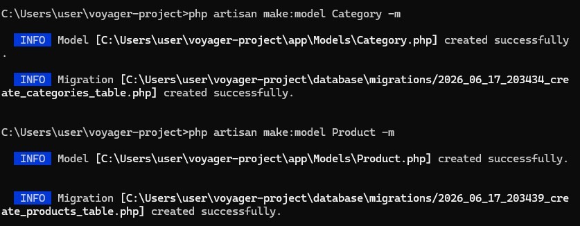

        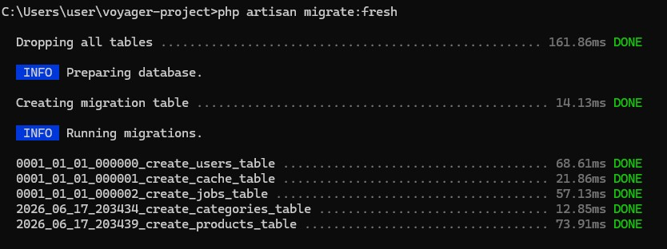
    
    - Установка и настройка Voyager
        
        Разворачиваем базу данных и ассеты админки
        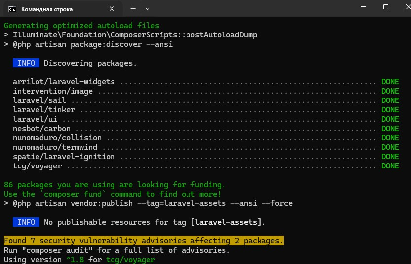

        Создаем аккаунт для входа:
        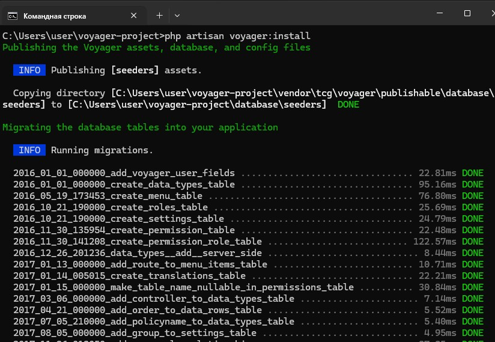

    - панель управления TCG Voyager

        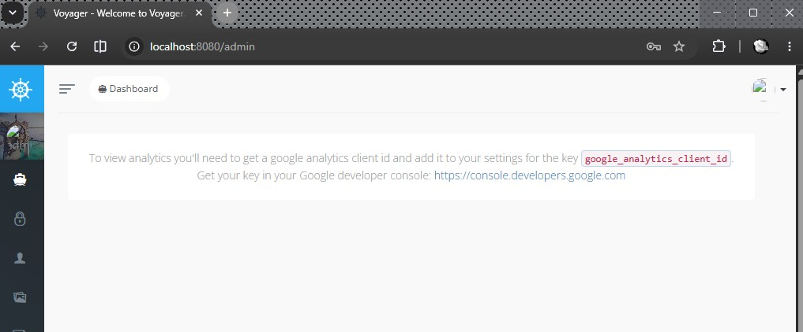


Дополнительные настройки и установки недостающих библиотек для устранения возникших конфликтов версий и ошибок систем при основной установке:

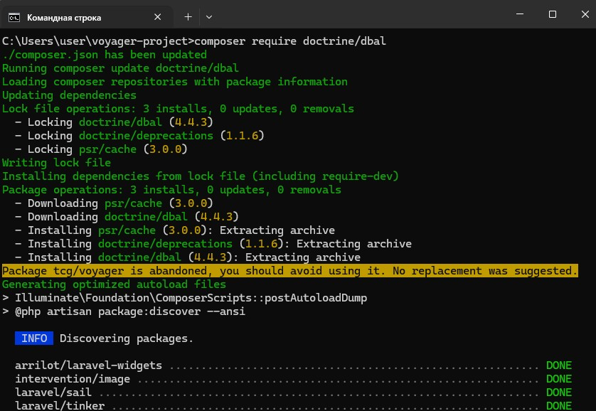

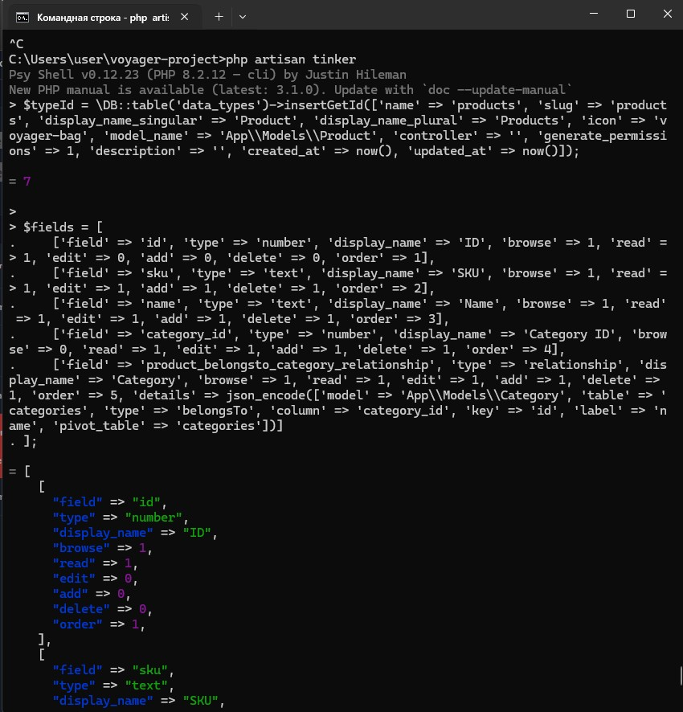

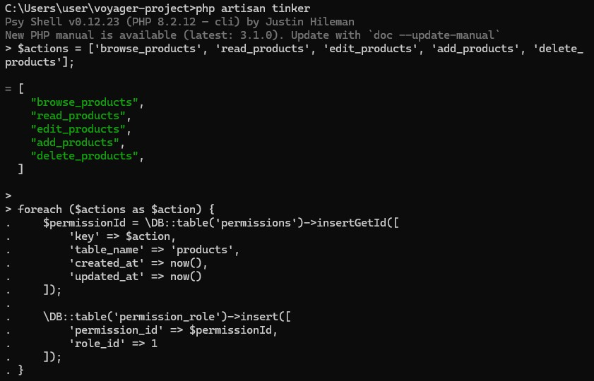


### Визуальная настройка BREAD в браузере

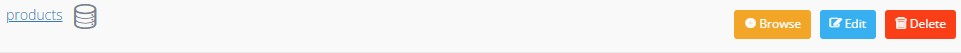


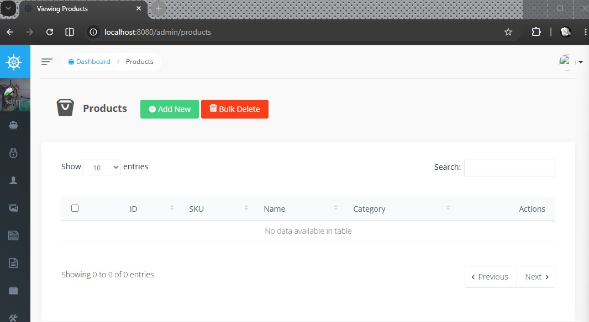


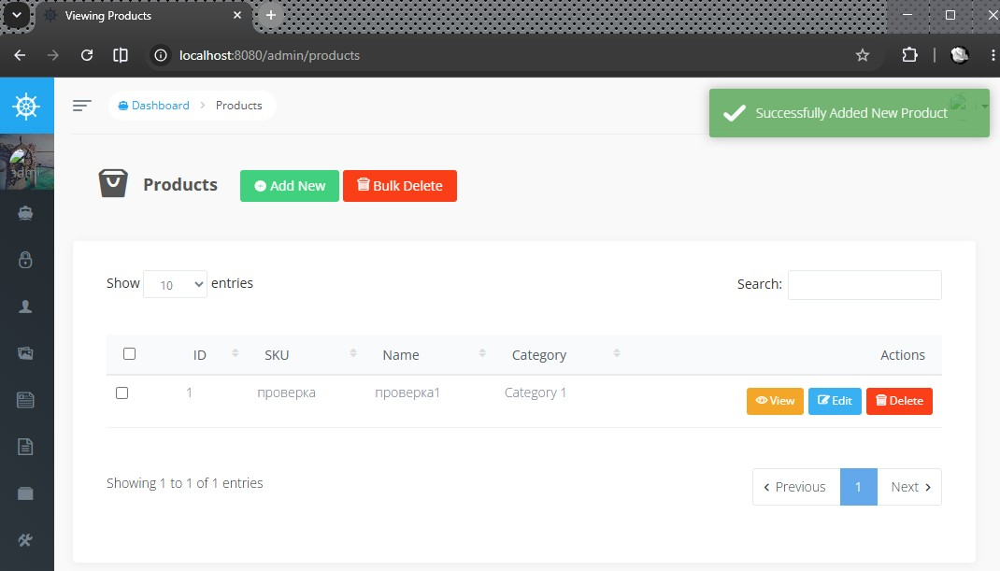